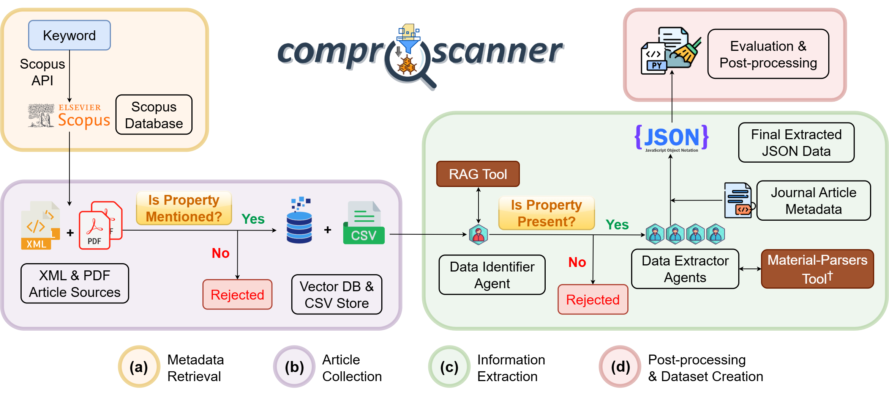

<p align="center">
  
</p>

## ComProScanner: A python package for extracting composition-property data from scientific articles for building databases

[](https://www.python.org/downloads/) [](https://creativecommons.org/licenses/by/4.0/)

## Overview

ComProScanner is a comprehensive Python package designed to extract composition-property relationships from scientific articles, particularly focused on materials science. It provides tools for metadata collection, article processing from various publishers (Elsevier, Wiley, Springer, IOP) directly if Text and Data Mining (TDM) API keys are provided or from already collected PDFs provided as a folder path, extraction of composition-property data, evaluation of extraction performance, and visualisation of results.

## Table of Contents

- [Installation](#installation)
- [Getting Started](#getting-started)
- [Core Modules](#core-modules)
- [Basic Usage](#basic-usage)
  - [Metadata Collection](#metadata-collection)
  - [Article Processing](#article-processing)
  - [Data Extraction](#data-extraction)
  - [Evaluation](#evaluation)
  - [Visualisation](#visualisation)
- [Workflow Details](#workflow-details)
  - [Overview Workflow Diagram](#overview-workflow-diagram)
  - [Data Extraction Flow](#data-extraction-flow)
- [Advanced Configuration](#advanced-configuration)
- [Project Structure](#project-structure)
- [License](#license)
- [Contact](#contact)

## Installation

```bash
pip install comproscanner
```

Or install from source:

```bash
git clone https://github.com/aritraroy24/comproscanner.git
cd comproscanner
pip install -e .
```

## Getting Started

The ComProScanner package follows a sequential workflow:

1. Collect and filter metadata from scientific articles related to user's property of interest
2. Process articles from various publishers to extract relevant text
3. Extract composition-property relationships from the processed text
4. Post Processing
   - Evaluate the quality of extraction if needed
   - Visualize the results

Basic usage example:

```python
from comproscanner import ComProScanner

# Initialize with property of interest
scanner = ComProScanner(main_property_keyword="piezoelectric")

# Collect metadata
scanner.collect_metadata(
    base_queries=["piezoelectric", "piezoelectricity"],
    extra_queries=["materials", "applications"],
    start_year=2022,
    end_year=2019
)

# Define property keywords for filtering
property_keywords = {
    "exact_keywords": ["d33"],
    "substring_keywords": [" d 33 "]
}

# Process articles from specific sources
scanner.process_articles(
    property_keywords=property_keywords,
    source_list=["elsevier", "springer"]
)

# Extract composition-property relationships
scanner.extract_composition_property_data(
    main_extraction_keyword="d33"
)
```

## Core Modules

ComProScanner is organized into several core modules:

1. **metadata_extractor**: Tools for collecting and filtering article metadata
2. **article_processors**: Processors for different publishers (Elsevier, Wiley, IOP, Springer, PDFs)
3. **extract_flow**: Flow for extracting composition-property and synthesis data
4. **post_processing**: Evaluation and visualisation tools
5. **utils**: Configuration, error handling, and logging utilities

## Basic Usage

### Metadata Collection

The `collect_metadata` function finds and filters relevant scientific articles based on the provided search criteria.

```python
from comproscanner import collect_metadata

collect_metadata(
    main_property_keyword="piezoelectric",
    base_queries=["piezoelectric", "piezoelectricity"],
    extra_queries=["materials", "applications"],
    start_year=2022,
    end_year=2019
)
```

**Parameters:**

- `main_property_keyword` (str): The main property of interest (e.g., "piezoelectric")
- `base_queries` (list, optional): Primary search terms
- `extra_queries` (list, optional): Secondary search terms combined with base queries
- `start_year` (int, optional): Starting year for the search (default: current year)
- `end_year` (int, optional): Ending year for the search (default: current year - 2)

### Article Processing

The `process_articles` function processes articles from various sources to extract relevant text for further analysis.

```python
from comproscanner import process_articles

property_keywords = {
    "exact_keywords": ["d33"],
    "substring_keywords": [" d 33 "]
}

process_articles(
    main_property_keyword="piezoelectric",
    property_keywords=property_keywords,
    source_list=["elsevier", "springer"],
    is_sql_db=False
)
```

**Parameters:**

- `main_property_keyword` (str): The main property keyword
- `property_keywords` (dict): Dictionary of keywords for filtering sentences
  - `exact_keywords`: List of keywords to match exactly
  - `substring_keywords`: List of keywords to match as substrings
- `source_list` (list, optional): List of sources to process (default: ["elsevier", "wiley", "iop", "springer", "pdfs"])
- `folder_path` (str, optional): Path to folder containing PDFs (required for "pdfs" source)
- `sql_batch_size` (int, optional): Batch size for SQL operations (default: 500)
- `csv_batch_size` (int, optional): Batch size for CSV operations (default: 1)
- `start_row` (int, optional): Start row for processing
- `end_row` (int, optional): End row for processing
- `doi_list` (list, optional): List of DOIs to process
- `is_sql_db` (bool, optional): Whether to use SQL database (default: False)
- `is_save_xml` (bool, optional): Whether to save XML files (default: False)
- `is_save_pdf` (bool, optional): Whether to save PDF files (default: False)
- `rag_db_path` (str, optional): Path to RAG database
- `chunk_size` (int, optional): Size of text chunks for RAG
- `chunk_overlap` (int, optional): Overlap between chunks for RAG
- `embedding_model` (str, optional): Name of embedding model for RAG

### Data Extraction

The `extract_composition_property_data` function extracts composition-property relationships and synthesis data from the processed text.

```python
from comproscanner import extract_composition_property_data

extract_composition_property_data(
    main_property_keyword="piezoelectric",
    main_extraction_keyword="d33",
    is_data_clean=True,
    model="gpt-4o-mini"
)
```

**Parameters:**

- `main_property_keyword` (str): The main property keyword
- `main_extraction_keyword` (str): The specific property to extract (e.g., "d33")
- `start_row` (int, optional): Start row for processing (default: 0)
- `num_rows` (int, optional): Number of rows to process
- `is_test_data_preparation` (bool, optional): Whether to prepare test data (default: False)
- `test_doi_list_file` (str, optional): File to store test DOIs
- `total_test_data` (int, optional): Target number of test data points
- `json_results_file` (str, optional): Path to store JSON results (default: "results.json")
- `csv_results_file` (str, optional): Path to store CSV results (default: "results.csv")
- `is_extract_synthesis_data` (bool, optional): Whether to extract synthesis data (default: True)
- `is_save_csv` (bool, optional): Whether to save results as CSV (default: False)
- `is_data_clean` (bool, optional): Whether to clean the data (default: False)
- `cleaning_strategy` (str, optional): Data cleaning strategy (default: "full")
- `is_create_knowledge_graph` (bool, optional): Whether to create a knowledge graph (default: False)
- `is_only_relevant_kg` (bool, optional): Whether to include only relevant data in knowledge graph (default: True)
- `materials_data_identifier_query` (str, optional): Query to identify materials data
- `model` (str, optional): LLM model to use (default: "gpt-4o-mini")
- `api_base` (str, optional): Base URL for API
- `base_url` (str, optional): Base URL for model service
- `api_key` (str, optional): API key for model service
- `output_log_folder` (str, optional): Folder to store logs
- `is_log_json` (bool, optional): Whether to save logs as JSON (default: False)
- `task_output_folder` (str, optional): Folder to store task outputs
- `verbose` (bool, optional): Whether to enable verbose output (default: True)
- `temperature` (float, optional): Temperature for LLM
- `top_p` (float, optional): Top-p sampling parameter for LLM
- `timeout` (int, optional): Request timeout in seconds
- `frequency_penalty` (float, optional): Frequency penalty for LLM
- `max_tokens` (int, optional): Maximum tokens for LLM completion
- `rag_db_path` (str, optional): Path to RAG database
- `embedding_model` (str, optional): Name of embedding model for RAG
- `rag_chat_model` (str, optional): Name of chat model for RAG
- `rag_max_tokens` (int, optional): Maximum tokens for RAG
- `rag_top_k` (int, optional): Top-k value for RAG
- `rag_base_url` (str, optional): Base URL for RAG model service
- `**flow_optional_args`: Additional optional arguments for extraction flow

#### Flow Optional Arguments

The extraction flow can be further customized with these optional arguments:

```python
flow_optional_args = {
    "composition_property_extraction_task_notes": [
        "Write complete chemical formulas (e.g. '(Use the abbreviation key-value pair to track the abbreviations while extracting composition-property keywords)",
        # More notes...
    ],
    "synthesis_extraction_task_notes": [
        "For synthesis_methods, use the short name of the method if possible",
        # More notes...
    ],
    # Other optional arguments...
}

# Pass these to extract_composition_property_data
scanner.extract_composition_property_data(
    main_extraction_keyword="d33",
    **flow_optional_args
)
```

Available flow optional arguments:

- `expected_composition_property_example` (str): Example of composition and property data
- `expected_variable_composition_property_example` (str): Example of variable composition and property data
- `composition_property_extraction_agent_notes` (list): Notes for composition extraction agent
- `composition_property_extraction_task_notes` (list): Notes for composition extraction task
- `composition_property_formatting_agent_notes` (list): Notes for composition formatting agent
- `composition_property_formatting_task_notes` (list): Notes for composition formatting task
- `synthesis_extraction_agent_notes` (list): Notes for synthesis extraction agent
- `synthesis_extraction_task_notes` (list): Notes for synthesis extraction task
- `synthesis_formatting_agent_notes` (list): Notes for synthesis formatting agent
- `synthesis_formatting_task_notes` (list): Notes for synthesis formatting task
- `allowed_synthesis_methods` (list): Allowed synthesis methods for knowledge-graph nodes
- `allowed_characterisation_techniques` (list): Allowed characterisation techniques for knowledge-graph nodes

### Evaluation

The package provides two methods for evaluating extraction quality:

#### Semantic Evaluation

```python
from comproscanner import evaluate_semantic

evaluate_semantic(
    ground_truth_file="ground_truth.json",
    test_data_file="test_results.json",
    output_file="evaluation_results.json",
    extraction_agent_model_name="gpt-4o-mini",
    is_synthesis_evaluation=True
)
```

**Parameters:**

- `ground_truth_file` (str): Path to ground truth data
- `test_data_file` (str): Path to test data
- `weights` (dict, optional): Weights for evaluation metrics
- `output_file` (str, optional): Path to save evaluation results (default: "semantic_evaluation_result.json")
- `extraction_agent_model_name` (str, optional): Model used for extraction (default: "gpt-4o-mini")
- `is_synthesis_evaluation` (bool, optional): Whether to evaluate synthesis extraction (default: True)
- `use_semantic_model` (bool, optional): Whether to use semantic model for evaluation (default: True)
- `primary_model_name` (str, optional): Primary semantic model (default: "thellert/physbert_cased")
- `fallback_model_name` (str, optional): Fallback semantic model (default: "all-MiniLM-L6-v2")
- `similarity_thresholds` (dict, optional): Similarity thresholds

#### Agentic Evaluation

```python
from comproscanner import evaluate_agentic

evaluate_agentic(
    ground_truth_file="ground_truth.json",
    test_data_file="test_results.json",
    output_file="agentic_evaluation_results.json",
    extraction_agent_model_name="gpt-4o-mini"
)
```

**Parameters:**

- `ground_truth_file` (str): Path to ground truth data
- `test_data_file` (str): Path to test data
- `output_file` (str, optional): Path to save evaluation results (default: "detailed_evaluation.json")
- `extraction_agent_model_name` (str, optional): Model used for extraction (default: "gpt-4o-mini")
- `is_synthesis_evaluation` (bool, optional): Whether to evaluate synthesis extraction (default: True)
- `weights` (dict, optional): Weights for evaluation metrics
- `llm` (LLM, optional): LLM instance

### Visualisation

The package provides two visualisation modules:

#### Data Visualisation

```python
from comproscanner import data_visualiser

# Plot material families distribution as pie chart
fig = data_visualiser.plot_family_pie_chart(
    data_sources=["results.json"],
    output_file="family_distribution.png",
    min_percentage=1.0
)

# Plot precursors distribution as histogram
fig = data_visualiser.plot_precursors_histogram(
    data_sources=["results.json"],
    output_file="precursors_distribution.png",
    max_items=15
)
```

##### Data Visualisation Functions

1. **plot_family_pie_chart** - Create a pie chart visualisation of material families distribution

   ```python
   plot_family_pie_chart(
       data_sources=None,         # List of paths to JSON files or dictionaries containing materials data
       folder_path=None,          # Path to folder containing JSON data files
       output_file=None,          # Path to save the output plot image
       figsize=(10, 8),           # Figure size as (width, height) in inches
       dpi=300,                   # DPI for output image
       min_percentage=1.0,        # Minimum percentage for a category to be shown separately
       title="Distribution of Material Families",  # Title for the plot
       colour_palette=None        # Matplotlib colormap name for the pie sections
   )
   ```

2. **plot_family_histogram** - Create a histogram visualisation of material families distribution

   ```python
   plot_family_histogram(
       data_sources=None,         # List of paths to JSON files or dictionaries containing materials data
       folder_path=None,          # Path to folder containing JSON data files
       output_file=None,          # Path to save the output plot image
       figsize=(12, 8),           # Figure size as (width, height) in inches
       dpi=300,                   # DPI for output image
       max_items=15,              # Maximum number of items to display
       title="Frequency Distribution of Material Families",  # Title for the plot
       colour_palette=None,       # Matplotlib colormap name for the bars
       x_label="Material Family", # Label for the x-axis
       y_label="Frequency",       # Label for the y-axis
       rotation=45                # Rotation angle for x-axis labels
   )
   ```

3. **plot_precursors_pie_chart** - Create a pie chart visualisation of precursors distribution

   ```python
   plot_precursors_pie_chart(
       data_sources=None,         # List of paths to JSON files or dictionaries containing materials data
       folder_path=None,          # Path to folder containing JSON data files
       output_file=None,          # Path to save the output plot image
       figsize=(10, 8),           # Figure size as (width, height) in inches
       dpi=300,                   # DPI for output image
       min_percentage=1.0,        # Minimum percentage for a category to be shown separately
       title="Distribution of Precursors in Materials Synthesis",  # Title for the plot
       colour_palette=None        # Matplotlib colormap name for the pie sections
   )
   ```

4. **plot_precursors_histogram** - Create a histogram visualisation of precursors distribution

   ```python
   plot_precursors_histogram(
       data_sources=None,         # List of paths to JSON files or dictionaries containing materials data
       folder_path=None,          # Path to folder containing JSON data files
       output_file=None,          # Path to save the output plot image
       figsize=(12, 8),           # Figure size as (width, height) in inches
       dpi=300,                   # DPI for output image
       max_items=15,              # Maximum number of items to display
       title="Frequency Distribution of Precursors in Materials Synthesis",  # Title for plot
       colour_palette=None,       # Matplotlib colormap name for the bars
       x_label="Precursor",       # Label for the x-axis
       y_label="Frequency",       # Label for the y-axis
       rotation=45                # Rotation angle for x-axis labels
   )
   ```

5. **plot_characterisation_techniques_pie_chart** - Create a pie chart visualisation of characterisation techniques

   ```python
   plot_characterisation_techniques_pie_chart(
       data_sources=None,         # List of paths to JSON files or dictionaries containing materials data
       folder_path=None,          # Path to folder containing JSON data files
       output_file=None,          # Path to save the output plot image
       figsize=(10, 8),           # Figure size as (width, height) in inches
       dpi=300,                   # DPI for output image
       min_percentage=1.0,        # Minimum percentage for a category to be shown separately
       title="Distribution of Characterisation Techniques",  # Title for the plot
       colour_palette=None        # Matplotlib colormap name for the pie sections
   )
   ```

6. **plot_characterisation_techniques_histogram** - Create a histogram visualisation of characterisation techniques
   ```python
   plot_characterisation_techniques_histogram(
       data_sources=None,         # List of paths to JSON files or dictionaries containing materials data
       folder_path=None,          # Path to folder containing JSON data files
       output_file=None,          # Path to save the output plot image
       figsize=(14, 8),           # Figure size as (width, height) in inches
       dpi=300,                   # DPI for output image
       max_items=15,              # Maximum number of items to display
       title="Frequency Distribution of Characterisation Techniques",  # Title for the plot
       colour_palette=None,       # Matplotlib colormap name for the bars
       x_label="Characterisation Technique",  # Label for the x-axis
       y_label="Frequency",       # Label for the y-axis
       rotation=45                # Rotation angle for x-axis labels
   )
   ```

#### Evaluation Visualisation

```python
from comproscanner import eval_visualiser

# Plot single bar chart for one evaluation result
fig = eval_visualiser.plot_single_bar_chart(
    result_file="evaluation_results.json",
    output_file="evaluation_metrics.png"
)

# Plot radar chart comparing multiple models
fig = eval_visualiser.plot_multiple_radar_charts(
    result_sources=["model1_results.json", "model2_results.json"],
    output_file="model_comparison_radar.png",
    model_names=["Model 1", "Model 2"]
)
```

##### Evaluation Visualisation Functions

1. **plot_single_bar_chart** - Bar chart for single evaluation result

   ```python
   plot_single_bar_chart(
       result_file=None,          # Path to the JSON file containing evaluation results
       result_dict=None,          # Dictionary containing evaluation results
       output_file=None,          # Path to save the output plot image
       model_name=None,           # Name of the model used for evaluation
       figsize=(12, 8),           # Figure size (width, height) in inches
       colormap="Blues",          # Matplotlib colormap name
       display_values=True,       # Whether to display metric values on bars
       title=None,                # Custom title for the plot
       typical_threshold=None,    # Typical threshold value for horizontal line
       threashold_line_style="--", # Style of the threshold line
       threashold_tolerance_range=0.03, # Tolerance range for threshold
       threshold_color="red",     # Color for the threshold line
       show_grid=True,            # Whether to display grid lines
       bar_width=0.6,             # Width of the bars
       y_axis_label="Score",      # Label for the y-axis
       x_axis_label=None,         # Label for the x-axis
       y_axis_range=(0, 1),       # Range for the y-axis
       dpi=300,                   # DPI for output image
       metrics_to_include=[       # List of metrics to include in the plot
           "overall_accuracy", "overall_composition_accuracy",
           "overall_synthesis_accuracy", "absolute_precision",
           "absolute_recall", "absolute_f1_score", "normalized_precision",
           "normalized_recall", "normalized_f1_score"
       ]
   )
   ```

2. **plot_multiple_bar_charts** - Bar charts comparing multiple models

   ```python
   plot_multiple_bar_charts(
       result_sources=None,       # List of paths to JSON files or dictionaries with evaluation results
       folder_path=None,          # Path to folder containing JSON result files
       output_file=None,          # Path to save the output plot image
       model_names=None,          # Names of models to display in the legend
       figsize=(14, 10),          # Figure size (width, height) in inches
       colormap="Blues",          # Matplotlib colormap name for the bars
       display_values=True,       # Whether to display metric values on bars
       title=None,                # Custom title for the plot
       typical_threshold=None,    # Typical threshold value for horizontal line
       threshold_line_style="--", # Style of the threshold line
       threashold_tolerance_range=0.03, # Tolerance range for threshold
       threshold_color="red",     # Color for the threshold line
       show_grid=True,            # Whether to display grid lines
       y_label="Score",           # Label for the y-axis
       x_label=None,              # Label for the x-axis
       group_width=0.8,           # Width allocated for each group of bars (0-1)
       bar_width=None,            # Width of individual bars
       legend_loc="best",         # Location of the legend
       legend_fontsize=10,        # Font size for the legend
       y_axis_range=(0, 1),       # Range for the y-axis
       dpi=300,                   # DPI for output image
       metrics_to_include=[       # List of metrics to include from the plot
           "overall_accuracy", "overall_composition_accuracy",
           "overall_synthesis_accuracy", "precision", "recall",
           "f1_score", "normalized_precision", "normalized_recall",
           "normalized_f1_score"
       ]
   )
   ```

3. **plot_single_radar_chart** - Radar chart for single evaluation result

   ```python
   plot_single_radar_chart(
       result_file=None,          # Path to JSON file containing evaluation results
       result_dict=None,          # Dictionary containing evaluation results
       output_file=None,          # Path to save the output plot image
       model_name=None,           # Name of the model for display
       figsize=(10, 8),           # Figure size (width, height) in inches
       colormap="Blues",          # Matplotlib colormap name
       display_values=False,      # Whether to display metric values on chart
       title=None,                # Custom title for the plot
       title_fontsize=14,         # Font size for the title
       title_pad=50.0,            # Padding for the title from top of plot
       typical_threshold=None,    # Threshold value for circular line
       threshold_color="red",     # Color for the threshold line
       threshold_line_style="--", # Style of the threshold line
       label_fontsize=12,         # Font size for axis labels
       value_fontsize=10,         # Font size for displayed values
       legend_loc="best",         # Location for the legend box
       legend_fontsize=10,        # Font size for the legend
       bbox_to_anchor=None,       # Bounding box for the legend box
       show_grid=True,            # Whether to display the grid lines
       show_grid_labels=False,    # Whether to display grid line values/labels
       grid_line_width=1.0,       # Width of the grid lines
       grid_line_style="-",       # Style of the grid lines
       grid_line_color="gray",    # Color of the grid lines
       grid_line_alpha=0.2,       # Alpha (transparency) of the grid lines
       fill_alpha=0.4,            # Alpha (transparency) of the filled area
       marker_size=7,             # Size of the data point markers
       line_width=2,              # Width of the plot lines
       label_padding=0.25,        # Distance padding for axis labels from plot
       clockwise=True,            # Direction of the radar chart
       start_angle=np.pi/2,       # Start angle in radians
       radar_range=(0, 1),        # Range for the radar axes
       dpi=300,                   # DPI for the output image
       metrics_to_include=None    # List of metrics to include
   )
   ```

4. **plot_multiple_radar_charts** - Radar chart comparing multiple models

   ```python
   plot_multiple_radar_charts(
       result_sources=None,       # List of paths to JSON files or dictionaries
       folder_path=None,          # Path to folder containing JSON result files
       output_file=None,          # Path to save the output plot image
       model_names=None,          # Names of models to display in the legend
       figsize=(12, 10),          # Figure size (width, height) in inches
       colormap="viridis",        # Matplotlib colormap name for plot lines
       display_values=False,      # Whether to display metric values on chart
       title=None,                # Custom title for the plot
       title_fontsize=14,         # Font size for the title
       title_pad=50.0,            # Padding for title from top of plot
       typical_threshold=None,    # Threshold value for circular line
       threshold_color="red",     # Color for the threshold line
       threshold_line_style="--", # Style of the threshold line
       label_fontsize=12,         # Font size for axis labels
       value_fontsize=10,         # Font size for displayed values
       legend_loc="best",         # Location of the legend
       bbox_to_anchor=None,       # Bounding box for the legend
       legend_fontsize=10,        # Font size for the legend
       show_grid=True,            # Whether to display the grid lines
       show_grid_labels=False,    # Whether to display grid line values/labels
       grid_line_width=1.0,       # Width of the grid lines
       grid_line_style="-",       # Style of the grid lines
       grid_line_color="gray",    # Color of the grid lines
       grid_line_alpha=0.2,       # Alpha (transparency) of the grid lines
       fill_alpha=0.25,           # Alpha (transparency) of the filled area
       marker_size=7,             # Size of the data point markers
       line_width=2,              # Width of the plot lines
       label_padding=0.25,        # Distance padding for axis labels from plot
       clockwise=True,            # Direction of the radar chart
       start_angle=np.pi/2,       # Start angle in radians
       radar_range=(0, 1),        # Range for the radar axes
       dpi=300,                   # DPI for the output image
       metrics_to_include=[      # List of metrics to include in the plot
           "overall_accuracy", "overall_composition_accuracy",
           "overall_synthesis_accuracy", "precision", "recall",
           "f1_score", "normalized_precision", "normalized_recall",
           "normalized_f1_score"
       ]
   )
   ```

5. **plot_single_performance_heatmap** - Heatmap for single model performance

   ```python
   plot_single_performance_heatmap(
       result_file=None,          # Path to JSON file with evaluation results
       result_dict=None,          # Dictionary containing evaluation results
       output_file=None,          # Path to save the output visualisation
       model_name=None,           # Name for the model in the plot
       figsize=(12, 12),          # Figure size as (width, height) in inches
       colormap="YlGnBu",         # Matplotlib colormap name for the heatmap
       bin_count=10,              # Number of bins to divide score range
       score_range=(0, 1),        # Min and max values for score bins
       use_percentage=True,       # Whether to show percentages or counts
       show_averages=False,       # Whether to show average scores per metric
       show_group_labels=False,   # Whether to show metric group labels
       show_annotations=False,    # Whether to show value annotations in cells
       annotation_format=None,    # Format string for annotations
       title=None,                # Custom title for the plot
       title_fontsize=14,         # Font size for the title text
       title_pad=None,            # Padding for title from top of plot
       labels=["Metrics", "Scores"], # Labels for the x and y axes
       label_fontsize=12,         # Font size for the axis labels
       dpi=300,                   # Resolution for saved image
       group_metrics=False,       # Whether to visually group related metrics
       metric_groups=None,        # Custom metric groups definition
       group_colors=None,         # Colors for metric groups
       include_metrics=None,      # Specific metrics to include
       exclude_metrics=None,      # Specific metrics to exclude
       group_label_right_margin=1, # Right margin for group labels
       average_value_left_margin=1, # Left margin for average values
       plot_padding=0.1,          # Padding between heatmap and axes
   )
   ```

6. **plot_multiple_performance_heatmaps** - Heatmaps comparing multiple models

   ```python
   plot_multiple_performance_heatmaps(
       result_sources=None,       # List of paths to JSON files or dictionaries
       folder_path=None,          # Path to folder with JSON result files
       output_file=None,          # Path to save the output visualisation
       model_names=None,          # Names to display for models in plots
       figsize=(14, 12),          # Figure size as (width, height) in inches
       colormap="YlGnBu",         # Matplotlib colormap name for the heatmap
       bin_count=10,              # Number of bins to divide score range
       score_range=(0, 1),        # Min and max values for score bins
       use_percentage=True,       # Whether to show percentages or counts
       show_averages=False,       # Whether to show average scores
       show_group_labels=False,   # Whether to show metric group labels
       show_annotations=False,    # Whether to show value annotations in cells
       annotation_format=None,    # Format string for annotations
       title=None,                # Custom title for the plot
       title_fontsize=14,         # Font size for the title
       labels=["Metrics", "Scores"], # Labels for the x and y axes
       label_fontsize=12,         # Font size for the axis labels
       dpi=300,                   # Resolution for saved image
       group_metrics=True,        # Whether to visually group related metrics
       metric_groups=None,        # Custom metric groups definition
       group_colors=None,         # Colors for metric groups
       include_metrics=None,      # Specific metrics to include
       exclude_metrics=None,      # Specific metrics to exclude
       sort_models_by="overall_accuracy", # Metric to sort models by
       combine_models=False,      # Whether to combine all models
       group_label_right_margin=1, # Right margin for group labels
       average_value_left_margin=1, # Left margin for average values
       plot_padding=0.1,          # Padding between heatmap and axes labels
   )
   ```

7. **plot_single_histogram_chart** - Histogram for single metric

   ```python
   plot_single_histogram_chart(
       result_file=None,          # Path to JSON file with evaluation results
       result_dict=None,          # Dictionary containing evaluation results
       metric_name="overall_accuracy", # Name of the metric to plot
       output_file=None,          # Path to save the output plot image
       model_name=None,           # Name of the model for display in title
       figsize=(8, 6),            # Figure size as (width, height) in inches
       bins=10,                   # Number of bins or bin edges for histogram
       color="skyblue",           # Color for the histogram bars
       color_gradient=False,      # Whether to use color gradient for bars
       gradient_colors=None,      # List of colors for gradient
       show_kde=False,            # Whether to show a KDE curve over histogram
       show_mean=False,           # Whether to show vertical line at mean
       mean_color="green",        # Color for the mean line
       mean_line_style="-",       # Line style for the mean line
       show_median=False,         # Whether to show vertical line at median
       median_color="black",      # Color for the median line
       median_line_style="-",     # Line style for the median line
       show_threshold=False,      # Whether to show a threshold line
       threshold_value=0.8,       # Value for the threshold line
       threshold_color="red",     # Color for the threshold line
       threshold_line_style="--", # Line style for the threshold line
       title=None,                # Custom title for the plot
       title_fontsize=14,         # Font size for the title
       xlabel=None,               # Custom label for x-axis
       ylabel="Count",            # Label for y-axis
       xlabel_fontsize=12,        # Font size for x-axis label
       ylabel_fontsize=12,        # Font size for y-axis label
       legend_loc="best",         # Location for the legend
       bbox_to_anchor=None,       # Bounding box for the legend
       dpi=300,                   # DPI for the output image
   )
   ```

8. **plot_multiple_histogram_charts** - Histograms comparing multiple models

   ```python
   plot_multiple_histogram_charts(
       result_sources=None,       # List of paths to JSON files or dictionaries
       folder_path=None,          # Path to folder with JSON result files
       output_file=None,          # Path to save the output plot image
       model_names=None,          # Names of models for display in titles
       metric_name="overall_accuracy", # Name of the metric to plot
       figsize=(14, 12),          # Figure size as (width, height) in inches
       bins=10,                   # Number of bins or bin edges for histogram
       colormap="tab10",          # Matplotlib colormap for histogram colors
       show_kde=False,            # Whether to show a KDE curve over histogram
       kde_alpha=0.7,             # Alpha value for the KDE curve
       show_mean=False,           # Whether to show vertical line at mean
       mean_color="green",        # Color for the mean line
       mean_line_style="-",       # Line style for the mean line
       show_median=False,         # Whether to show vertical line at median
       median_color="black",      # Color for the median line
       median_line_style="-",     # Line style for the median line
       show_threshold=False,      # Whether to show a threshold line
       threshold_value=0.8,       # Value for the threshold line
       threshold_color="red",     # Color for the threshold line
       threshold_line_style="--", # Line style for the threshold line
       show_grid=True,            # Whether to show grid lines on the plot
       title=None,                # Custom title for the plot
       title_fontsize=14,         # Font size for the title
       xlabel=None,               # Custom label for x-axis
       ylabel="Count",            # Label for y-axis
       xlabel_fontsize=12,        # Font size for x-axis label
       ylabel_fontsize=12,        # Font size for y-axis label
       legend_loc="best",         # Location for the legend
       legend_fontsize=10,        # Font size for the legend
       bbox_to_anchor=None,       # Bounding box for the legend
       is_normalized=True,        # Whether to normalize histograms
       shared_bins=True,          # Whether to use shared bins across histograms
       dpi=300,                   # DPI for the output image
   )
   ```

9. **plot_single_violin_chart** - Violin plot for single model

   ```python
   plot_single_violin_chart(
       result_file=None,          # Path to JSON file with evaluation results
       result_dict=None,          # Dictionary containing evaluation results
       output_file=None,          # Path to save the output visualisation
       model_name=None,           # Name to display for the model in the plot
       figsize=(14, 10),          # Figure size as (width, height) in inches
       colormap="Blues",          # Matplotlib colormap name for the violins
       title=None,                # Custom title for the plot
       title_fontsize=14,         # Font size for the title text
       title_pad=10.0,            # Padding for title from top of plot
       show_box=False,            # Whether to show a box plot inside violin
       show_mean=True,            # Whether to show the mean marker
       mean_marker="o",           # Marker style for the mean
       mean_color="red",          # Color for the mean marker
       show_median=False,         # Whether to show the median line
       median_color="green",      # Color for the median line
       median_line_style="-",     # Line style for the median
       show_grid=True,            # Whether to display the grid lines
       show_threshold=False,      # Whether to show a threshold line
       threshold_value=0.8,       # Value for the threshold line
       threshold_color="red",     # Color for the threshold line
       threshold_line_style="--", # Line style for the threshold line
       violin_alpha=0.7,          # Alpha (transparency) of the violin plots
       violin_width=0.8,          # Width of the violin plots
       x_label="Metrics",         # Label for the x-axis
       y_label="Score",           # Label for the y-axis
       x_label_fontsize=12,       # Font size for x-axis label
       y_label_fontsize=12,       # Font size for y-axis label
       y_axis_range=(0, 1),       # Range for the y-axis
       label_rotation=45,         # Rotation angle for x-axis labels
       inner="box",               # Representation of data points inside violin
       dpi=300,                   # Resolution for saved image
       include_metrics=None,      # Specific metrics to include in the plot
       exclude_metrics=None,      # Specific metrics to exclude from the plot
   )
   ```

10. **plot_multiple_violin_charts** - Violin plots comparing multiple models
    ```python
    plot_multiple_violin_charts(
        result_sources=None,       # List of paths to JSON files or dictionaries
        folder_path=None,          # Path to folder with JSON result files
        output_file=None,          # Path to save the output visualisation
        model_names=None,          # Names to display for models in the plot
        metric_name="overall_accuracy", # Name of metric to compare across models
        figsize=(12, 8),           # Figure size as (width, height) in inches
        colormap="viridis",        # Matplotlib colormap name for the violins
        title=None,                # Custom title for the plot
        title_fontsize=14,         # Font size for the title text
        title_pad=50.0,            # Padding for title from top of plot
        show_box=False,            # Whether to show a box plot inside violin
        show_mean=True,            # Whether to show the mean marker
        mean_marker="o",           # Marker style for the mean
        mean_color="red",          # Color for the mean marker
        show_median=False,         # Whether to show the median line
        median_color="green",      # Color for the median line
        median_line_style="-",     # Line style for the median
        show_grid=True,            # Whether to display the grid lines
        show_threshold=False,      # Whether to show a threshold line
        threshold_value=0.8,       # Value for the threshold line
        threshold_color="red",     # Color for the threshold line
        threshold_line_style="--", # Line style for the threshold line
        violin_alpha=0.7,          # Alpha (transparency) of the violin plots
        violin_width=0.8,          # Width of the violin plots
        x_label="Models",          # Label for the x-axis
        y_label="Score",           # Label for the y-axis
        x_label_fontsize=12,       # Font size for x-axis label
        y_label_fontsize=12,       # Font size for y-axis label
        y_axis_range=(0, 1),       # Range for the y-axis
        label_rotation=45,         # Rotation angle for x-axis labels
        inner="box",               # Representation of data points inside violin
        dpi=300,                   # Resolution for saved image
    )
    ```

## Workflow Details

### Overview Workflow Diagram

Provides a clear explanation of the five main stages in the ComProScanner workflow:

Metadata Collection - finding relevant scientific articles
Article Processing - extracting relevant text from various publishers
Data Extraction - using LLMs to extract structured data
Post Processing - evaluation, cleaning and data visualisation

<div align="center">
  
  <p>Overall Workflow Diagram</p>
</div>

### Data Extraction Flow

Detailed explanation how the extraction process leverages CrewAI's agentic framework.

- Materials Data Identifier Agent - determines if articles contain relevant data
- Composition-Property Extraction Agent - extracts compositions, property values, and material family information
- Synthesis Extraction Agent - extracts synthesis methods, precursors, and characterization techniques (when enabled)
- Data Formatting Agents (x2) - ensure standardized JSON output

## Advanced Configuration

### RAG Configuration

Retrieval-Augmented Generation (RAG) can be configured for improved extraction:

```python
from comproscanner.utils.configs.rag_config import RAGConfig

rag_config = RAGConfig(
    rag_db_path="./vector_db",
    chunk_size=1000,
    chunk_overlap=25,
    embedding_model="huggingface:thellert/physbert_cased",
    rag_chat_model="gpt-4o-mini",
    rag_max_tokens=512,
    rag_top_k=3
)
```

#### RAG Embedding Model Configuration Options

Here's how to configure different embedding model types in the ComProScanner package for RAG:

**HuggingFace Models**

```python
from comproscanner.utils.configs.rag_config import RAGConfig

huggingface_config = RAGConfig(
    rag_db_path="./vector_db",
    chunk_size=1000,
    chunk_overlap=25,
    embedding_model="huggingface:thellert/physbert_cased",  # Physics-specific BERT
    rag_chat_model="gpt-4o-mini",
    rag_max_tokens=512,
    rag_top_k=3
)
```

**Sentence Transformers Models**

```python
from comproscanner.utils.configs.rag_config import RAGConfig

sentence_transformers_config = RAGConfig(
    rag_db_path="./vector_db",
    chunk_size=800,
    chunk_overlap=50,
    embedding_model="sentence-transformers:all-MiniLM-L6-v2",
    rag_chat_model="gpt-4o-mini",
    rag_max_tokens=512,
    rag_top_k=3
)
```

**OpenAI Models**

```python
from comproscanner.utils.configs.rag_config import RAGConfig

# Using OpenAI model with explicit prefix
openai_config = RAGConfig(
    rag_db_path="./vector_db",
    chunk_size=1000,
    chunk_overlap=100,
    embedding_model="openai:text-embedding-3-small",
    rag_chat_model="gpt-4o-mini",
    rag_max_tokens=512,
    rag_top_k=3
)

# Using OpenAI model without prefix (default behavior)
default_openai_config = RAGConfig(
    rag_db_path="./vector_db",
    chunk_size=1000,
    chunk_overlap=100,
    embedding_model="text-embedding-3-small",
    rag_chat_model="gpt-4o-mini",
    rag_max_tokens=512,
    rag_top_k=3
)
```

Note: For OpenAI models, ensure the organisation has access to the specified embedding model.

#### RAG Tool Configuration Options

The ComProScanner package provides a flexible RAG tool that supports multiple language model providers. The package understands the model name prefix to determine the appropriate provider and configuration.:

##### OpenAI Models

```python
from comproscanner.utils.configs.rag_config import RAGConfig

openai_config = RAGConfig(
    rag_db_path="./vector_db",
    rag_chat_model="gpt-4o-mini",  # No prefix needed for OpenAI models
    temperature=0.1,
    streaming=False,
    rag_max_tokens=512,
    rag_top_k=3
)
```

##### Google Gemini Models

```python
from comproscanner.utils.configs.rag_config import RAGConfig

gemini_config = RAGConfig(
    rag_db_path="./vector_db",
    rag_chat_model="gemini-2.0-flash-thinking-exp",  # 'gemini' prefix indicates Google provided model
    temperature=0.2,
    streaming=True,
    rag_max_tokens=1024,
    rag_top_k=5
)
```

##### Anthropic Claude Models

```python
from comproscanner.utils.configs.rag_config import RAGConfig

claude_config = RAGConfig(
    rag_db_path="./vector_db",
    rag_chat_model="claude-3-5-haiku-20241022",  # 'claude' prefix indicates Anthropic provided model
    temperature=0.0,
    streaming=False,
    rag_max_tokens=2048,
    rag_top_k=3
)
```

##### Ollama Models

```python
from comproscanner.utils.configs.rag_config import RAGConfig

ollama_config = RAGConfig(
    rag_db_path="./vector_db",
    rag_chat_model="ollama/llama3",  # 'ollama/' prefix indicates Ollama provided model
    rag_base_url="http://localhost:11434",  # Custom Ollama server URL
    temperature=0.5,
    streaming=True,
    rag_max_tokens=512,
    rag_top_k=3
)
```

##### Together AI Models

```python
from comproscanner.utils.configs.rag_config import RAGConfig

together_config = RAGConfig(
    rag_db_path="./vector_db",
    rag_chat_model="together/mistral-7b-instruct",  # 'together/' prefix indicates Together AI provided model
    temperature=0.7,
    streaming=False,
    rag_max_tokens=1024,
    rag_top_k=3
)
```

##### OpenRouter Models

```python
from comproscanner.utils.configs.rag_config import RAGConfig

openrouter_config = RAGConfig(
    rag_db_path="./vector_db",
    rag_chat_model="openrouter/meta-llama/llama-3-70b-instruct",  # 'openrouter/ ' prefix indicates OpenRouter provided model
    temperature=0.2,
    streaming=False,
    rag_max_tokens=512,
    rag_top_k=3
)
```

##### Cohere Models

```python
from comproscanner.utils.configs.rag_config import RAGConfig

cohere_config = RAGConfig(
    rag_db_path="./vector_db",
    rag_chat_model="cohere/command-r",  # 'cohere/' prefix indicates Cohere provided model
    temperature=0.3,
    streaming=False,
    rag_max_tokens=512,
    rag_top_k=3
)
```

##### Fireworks Models

```python
from comproscanner.utils.configs.rag_config import RAGConfig

fireworks_config = RAGConfig(
    rag_db_path="./vector_db",
    rag_chat_model="fireworks/llama-v3-8b",  # 'fireworks/' prefix indicates Fireworks provided model
    temperature=0.1,
    streaming=False,
    rag_max_tokens=512,
    rag_top_k=3
)
```

**Dependencies**

The RAG tool dynamically checks for required package dependencies based on the selected model:

- OpenAI models require `langchain_openai`
- Google Gemini models require `langchain_google_genai`
- Anthropic Claude models require `langchain_anthropic`
- Ollama models require `langchain_ollama`
- Together AI models require `langchain_together`
- OpenRouter models require `langchain_openrouter`
- Cohere models require `langchain_cohere`
- Fireworks models require `langchain_fireworks`

If the required package is not installed, the tool will raise an `ImportErrorHandler` exception with appropriate guidance.

## Project Structure

```
comproscanner/
├── src/
│   └── comproscanner/
│       ├── article_processors/       # Processors for different publishers
│       ├── extract_flow/             # Data extraction flow components
│       ├── metadata_extractor/       # Metadata collection and filtering
│       ├── post_processing/          # Data cleaning and evaluation
│       │   ├── evaluation/           # Evaluation tools
│       │   └── visualisation/        # Visualisation tools
│       ├── utils/                    # Utility functions and configurations
│       ├── __init__.py               # Package initialisation
│       ├── comproscanner.py          # Main class implementation
│       ├── data_visualiser.py        # Data visualisation tools
│       └── eval_visualiser.py        # Evaluation visualisation tools
├── tests/                            # Test suite
├── .env                              # Environment variables
├── pyproject.toml                    # Project metadata
└── README.md                         # This file
```

## License

This project is licensed under the [Creative Commons Attribution 4.0 International License (CC BY 4.0)](./LICENSE)

## Contact

Author: Aritra Roy  
Email: contact@aritraroy.live  
Website: https://aritraroy.live
