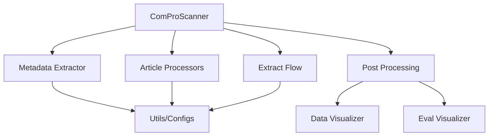

# Project Structure

Understanding the ComProScanner codebase organization.

## Directory Structure

```
comproscanner
├── src
│   └── comproscanner
│       ├── article_processors
│       │   ├── __init__.py
│       │   ├── elsevier_processor.py
│       │   ├── iop_processor.py
│       │   ├── pdfs_processor.py
│       │   ├── springer_processor.py
│       │   └── wiley_processor.py
│       ├── extract_flow
│       │   ├── crews
│       │   │   ├── materials_data_identifier_crew/
│       │   │   ├── composition_crew
│       │   │   │   ├── composition_extraction_crew/
│       │   │   │   └── composition_format_crew/
│       │   │   └── synthesis_crew
│       │   │       ├── synthesis_extraction_crew/
│       │   │       └── synthesis_format_crew/
│       │   ├── tools
│       │   │   ├── __init__.py
│       │   │   ├── equation_tool.py
│       │   │   ├── graph_extractor_tool.py
│       │   │   ├── material_parser_tool.py
│       │   │   └── rag_tool.py
│       │   ├── __init__.py
│       │   └── main_extraction_flow.py
│       ├── metadata_extractor
│       │   ├── __init__.py
│       │   ├── fetch_metadata.py
│       │   └── filter_metadata.py
│       ├── post_processing
│       │   ├── evaluation
│       │   │   ├── eval_flow
│       │   │   │   ├── crews
│       │   │   │   │   ├── composition_evaluation_crew/
│       │   │   │   │   └── synthesis_evaluation_crew/
│       │   │   │   ├── __init__.py
│       │   │   │   └── eval_flow.py
│       │   │   ├── __init__.py
│       │   │   └── semantic_evaluator.py
│       │   ├── visualization
│       │   │   ├── __init__.py
│       │   │   ├── create_knowledge_graph.py
│       │   │   ├── data_distribution_visualizers.py
│       │   │   └── eval_plot_visualizers.py
│       │   ├── __init__.py
│       │   └── data_cleaner.py
│       ├── utils/
│       ├── __init__.py
│       ├── comproscanner.py
│       ├── data_visualizer.py
│       └── eval_visualizer.py
├── assets/
├── docs/
├── examples/
├── tests/
├── .env
├── .env.example
├── .gitignore
├── CITATION.cff
├── CHANGELOG.md
├── CONTRIBUTING.md
├── LICENSE
├── README.md
├── mkdocs.yml
├── paper-dependencies.txt
└── pyproject.toml

```

## Module Dependencies


```mermaid
graph TB
    A[ComProScanner] --> B[Metadata Extractor]
    A --> C[Article Processors]
    A --> D[Extract Flow]
    A --> E[Post Processing]

    B --> F[Utils/Configs]
    C --> F
    D --> F

    E --> G[Data Visualizer]
    E --> H[Eval Visualizer]
```
