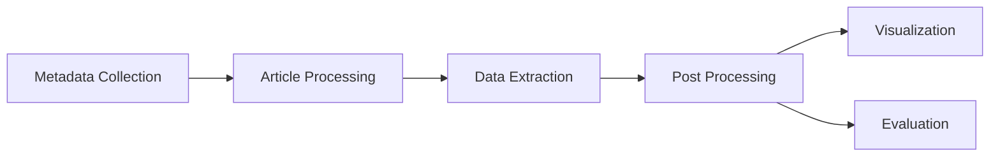

# ComProScanner Documentation

<p align="center">
  
</p>

<p align="center">
  <a href="https://www.python.org/downloads/"></a>
  <a href="https://opensource.org/licenses/MIT"></a>
  <a href="https://pypi.org/project/comproscanner/"></a>
</p>

## Welcome

**ComProScanner** is a comprehensive Python package designed to extract composition-property relationships from scientific articles, particularly focused on materials science. It provides tools for metadata collection, article processing from various publishers, extraction of composition-property data, evaluation of extraction performance, and visualization of results.

## Key Features

!!! tip "Automated Data Extraction"
Extract composition-property relationships in structured format from scientific literature automatically using AI-powered agents.

!!! example "Multi-Publisher Support"
Process articles from Elsevier, Wiley, Springer, IOP with TDM API integration, and support local PDF for all publishers.

!!! warning "Comprehensive Evaluation"
Built-in semantic and agentic evaluation methods to assess extraction quality in a faster automated manner.

!!! note "Rich Visualization"
Create beautiful charts, graphs, and knowledge graphs from extracted data and evaluation results out of the box.

## Quick Start

Get started with ComProScanner in just a few steps:

### Installation

```bash
pip install comproscanner
```

### Basic Usage

```python
from comproscanner import ComProScanner

# Initialize with property of interest
scanner = ComProScanner(main_property_keyword="piezoelectric")

# Collect metadata
scanner.collect_metadata(
    base_queries=["piezoelectric", "piezoelectricity"],
)

# Define property keywords for filtering
property_keywords = {
    "exact_keywords": ["d33"],
    "substring_keywords": [" d 33 "]
}

# Process articles
scanner.process_articles(
    property_keywords=property_keywords,
    source_list=["elsevier", "springer"]
)

# Extract data
scanner.extract_composition_property_data(
    main_extraction_keyword="d33"
)
```

## Workflow Overview

ComProScanner follows a sequential workflow:

#### Basic Flowchart



#### Workflow Diagram


1. **Metadata Collection** - Find relevant scientific articles from Scopus database
2. **Article Processing** - Extract full text articles from various publishers to prepare for data extraction
3. **Data Extraction** - Use multiple AI agents to extract structured data from collected articles
4. **Post Processing** - Evaluate extracted data and create charts for visualization along with data cleaning

## Core Modules

<div class="grid cards" markdown>

- :material-database-search: **Metadata Extractor**<br>
  Function for collecting and filtering article metadata from Scopus database.<br>
  [:octicons-arrow-right-24: Learn more](usage/metadata-collection.md)

- :material-file-document-multiple: **Article Processor**<br>
  Function for processing articles from different publishers: Elsevier, Wiley, IOP, Springer, and local PDFs (any publisher).<br>
  [:octicons-arrow-right-24: Learn more](usage/article-processing.md)

- :material-crane: **Composition-Property Extractor**<br>
  Function for AI agents-powered extraction flow for composition-property and synthesis data in a structured format.<br>
  [:octicons-arrow-right-24: Learn more](usage/data-extraction.md)

- :octicons-checklist-16: **Evaluator**<br>
  Functions for automated semantic and agentic evaluation methods to assess extraction quality.<br>
  [:octicons-arrow-right-24: Learn more](usage/evaluation/overview.md)

- :material-chart-box: **Visualizer**<br>
  Functions for visualizing extracted data and evaluation results out of the box.<br>
  [:octicons-arrow-right-24: Learn more](usage/visualization/overview.md)

</div>

## What's Next?

<div class="grid cards" markdown>

- :fontawesome-solid-rocket: **[Getting Started](getting-started/installation.md)**<br>
  Learn the basics and get ComProScanner up and running quickly.

- :fontawesome-solid-book: **[User Guide](usage/metadata-collection.md)**<br>
  Comprehensive guides for all features and capabilities.

- :material-hammer-wrench: **[Advanced Configuration](rag-config.md)**<br>
  Advanced features like RAG configuration and custom flows.

</div>

## Paper

Read the details of ComProScanner in the following preprint: [arXiv:2510.20362](https://arxiv.org/abs/2510.20362)

## Citation

If you use ComProScanner in your research, please cite:

```bibtex
@misc{roy2025comproscannermultiagentbasedframework,
      title={ComProScanner: A multi-agent based framework for composition-property structured data extraction from scientific literature},
      author={Aritra Roy and Enrico Grisan and John Buckeridge and Chiara Gattinoni},
      year={2025},
      eprint={2510.20362},
      archivePrefix={arXiv},
      primaryClass={physics.comp-ph},
      url={https://arxiv.org/abs/2510.20362},
}
```

## Community & Support

- **GitHub**: [slimeslab/ComProScanner](https://github.com/slimeslab/ComProScanner)
- **PyPI**: [comproscanner](https://pypi.org/project/comproscanner/)
- **Issues**: [Report a bug](https://github.com/slimeslab/ComProScanner/issues)
- **Email**: [contact@aritraroy.live](mailto:contact@aritraroy.live)

## License

ComProScanner is licensed under the [MIT License](about/license.md).
