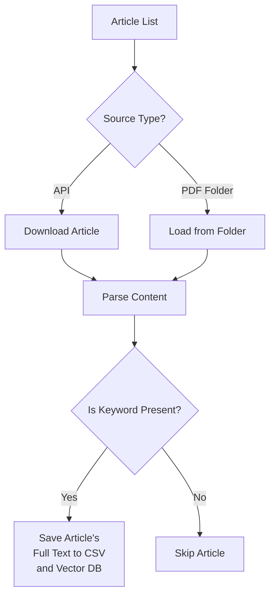

# Article Processing

The article processing module extracts full article text from various publishers or locally stored PDFs for information extraction at later stages only if query keywords are present.

## Supported Publishers

| Publisher       | TDM API Required | Features                                                                                                   |
| --------------- | ---------------- | ---------------------------------------------------------------------------------------------------------- |
| Elsevier        | Yes              | Full-text access via TDM API extraction                                                                    |
| Springer Nature | Yes              | Full-text access via TDM API extraction                                                                    |
| Wiley           | Yes              | Full-text access via TDM API extraction                                                                    |
| IOP Publishing  | No               | IOP provides bulk access to full-text XML articles via SFTP transfer                                       |
| PDFs            | No               | Local PDF processing (any publication) using [Docling](https://github.com/docling-project/docling) package |

## Basic Usage

```python
property_keywords = {
    "exact_keywords": ["d33"],
    "substring_keywords": [" d 33 "]
}

scanner.process_articles(
    property_keywords=property_keywords,
    source_list=["elsevier", "springer", "wiley"]
)
```

## Parameters

### Required Parameters

#### :material-square-medium:`property_keywords` _(dict)_

Dictionary consisting of _exact_keywords_ and _substring_keywords_ lists defining keywords for filtering using string matching:

```python
property_keywords = {
    "exact_keywords": ["d33"],
    "substring_keywords": [" d 33 ", " d 3 3 "]
}
```

- _exact_keywords_: Match exact occurrences
- _substring_keywords_: Match as substrings (useful for spaced notation or substring matches)

### Optional Parameters

#### :material-square-medium:`source_list` _(list)_

List of sources to process, both publishers and/or local PDFs.

#### :material-square-medium:`folder_path` _(str)_

Path to folder containing local PDFs. If `source_list` includes "pdfs", this parameter must be provided.

#### :material-square-medium:`doi_list` _(list)_

List of specific DOIs to process. If provided, only these articles will be processed.

#### :material-square-medium:`is_sql_db` _(bool)_

Flag to indicate if SQL database storage is enabled.

#### :material-square-medium:`csv_batch_size` _(int)_

Article batch size for CSV file operations.

#### :material-square-medium:`sql_batch_size` _(int)_

Article batch size for SQL database operations. Only relevant if `is_sql_db` is `True`.

#### :material-square-medium:`start_row` _(int)_

Row number from the metadata CSV file to start processing from (for resuming).

#### :material-square-medium:`end_row` _(int)_

Row number from the metadata CSV file to end processing at.

#### :material-square-medium:`is_save_xml` _(bool)_

Flag to indicate if XML files for full-text articles should be saved.

#### :material-square-medium:`is_save_pdf` _(bool)_

Flag to indicate if PDF files for full-text articles should be saved.

#### :material-square-medium:`rag_db_path` _(str)_

Custom path to store the vector databases of property-mentioned articles for RAG processing.

#### :material-square-medium:`chunk_size` _(int)_

Size of the chunks to split articles into while creating vector databases for RAG.

#### :material-square-medium:`chunk_overlap` _(int)_

Overlap size between chunks for creating vector databases for RAG.

#### :material-square-medium:`embedding_model` _(str)_

Name of the embedding model to use for creating vector databases for RAG.

!!! info "Default Values"

    :material-square-small:**`source_list`** = ["elsevier", "wiley", "iop", "springer"]<br>:material-square-small:**`folder_path`** = None<br>:material-square-small:**`doi_list`** = None<br>:material-square-small:**`is_sql_db`** = False<br>:material-square-small:**`is_save_xml`** = False<br>:material-square-small:**`is_save_pdf`** = False<br>:material-square-small:**`rag_db_path`** = "db"<br>:material-square-small:**`chunk_size`** = 1000<br>:material-square-small:**`chunk_overlap`** = 25<br>:material-square-small:**`embedding_model`** = "huggingface:thellert/physbert_cased"

## Processing Workflow



## Publisher-Specific Details

### Elsevier

```python
# Requires SCOPUS_API_KEY in .env
scanner.process_articles(
    property_keywords=property_keywords,
    source_list=["elsevier"],
    is_save_xml=True,  # Save XML files
)
```

### Springer Nature

```python
# Requires SPRINGER_OPENACCESS_API_KEY and SPRINGER_TDM_API_KEY in .env
scanner.process_articles(
    property_keywords=property_keywords,
    source_list=["springer"],
    is_save_xml=True   # Save XML files
)
```

### Wiley

```python
# Requires WILEY_API_KEY in .env
scanner.process_articles(
    property_keywords=property_keywords,
    source_list=["wiley"],
    is_save_pdf=True   # Save PDF files
)
```

### IOP Publishing

```python
# Requires IOP_papers_path in .env
scanner.process_articles(
    property_keywords=property_keywords,
    source_list=["iop"]
)
```

### Local PDFs

```python
scanner.process_articles(
    property_keywords=property_keywords,
    source_list=["pdfs"],
    folder_path="/home/user/papers"
)
```

## Advanced Features

### Database Storage

```python
# Requires DATABASE_HOST, DATABASE_USER, DATABASE_PASSWORD, and DATABASE_NAME in .env
scanner.process_articles(
    property_keywords=property_keywords,
    is_sql_db=True,  # Use SQL database
    sql_batch_size=500
)
```

### Selective Processing

Process specific DOIs:

```python
doi_list = [
    "10.1016/j.example.2023.1",
    "10.1016/j.example.2023.2"
]

scanner.process_articles(
    property_keywords=property_keywords,
    doi_list=doi_list
)
```

### RAG Vector Database

```python
scanner.process_articles(
    property_keywords=property_keywords,
    rag_db_path="embeddings",
    chunk_size=800,
    chunk_overlap=100,
    embedding_model="sentence-transformers:all-mpnet-base-v2"
)
```

## Output Format

Similar to the following example, minimal metadata along with full article text for different sections is stored in a CSV file (along with creating an embedded vector database separately) only if the article contains the specified keywords. If keywords are not found, no paragraphs are saved for that article.

```csv title="elsevier_piezoelectric_paragraphs.csv" linenums="1"
doi,article_title,publication_name,publisher,abstract,introduction,exp_methods,comp_methods,results_discussion,conclusion,is_property_mentioned
10.1016/j.bios.2025.117148,Enhanced piezoelectric sensor to distinguish real-time arrhythmia for predicting heart failure,Biosensors and Bioelectronics,Elsevier B.V.,"Monitoring cardiac rhythm is crucial..."," Heart failure affects approximately 32 million individuals globally..."," Initially, PVDF powder (Aladdin, Shanghai, China) was dissolved...",," The aligned PVDF/CoFe2O4 films exhibited excellent flexibility..."," In this study, the higher sensitivity piezoelectric sensors were developed...",1
10.1016/j.seppur.2024.131085,Crystallization-based recovery of niobium compounds from alkaline liquor,Separation and Purification Technology,Elsevier B.V.,,,,,,,0
// More articles...
```

## Next Steps

- Continue to [Data Extraction](data-extraction.md)
- Learn about [RAG Configuration](../rag-config.md)
