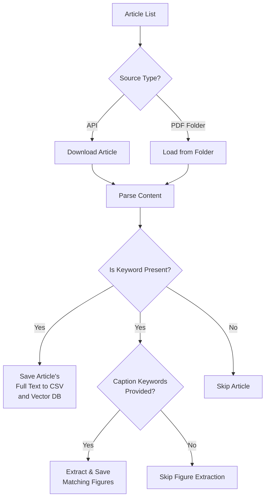

# Article Processing

The article processing module extracts full article text from various publishers or locally stored PDFs for information extraction at later stages only if query keywords are present.

## Supported Publishers

| Publisher       | TDM API Required | Features                                                                                                   |
| --------------- | ---------------- | ---------------------------------------------------------------------------------------------------------- |
| Elsevier        | Yes              | Full-text access via TDM API extraction                                                                    |
| Springer Nature | Yes              | Full-text access via TDM API extraction                                                                    |
| Wiley           | Yes              | Full-text access via TDM API extraction                                                                    |
| IOP Publishing  | No               | IOP provides bulk access to full-text XML articles via SFTP transfer                                       |
| PDFs            | No               | Local PDF processing (any publication) using [Docling](https://github.com/docling-project/docling) package |

## Basic Usage

```python
property_keywords = {
    "exact_keywords": ["d33"],
    "substring_keywords": [" d 33 "]
}

scanner.process_articles(
    property_keywords=property_keywords,
    source_list=["elsevier", "springer", "wiley"]
)
```

## Parameters

### Required Parameters

#### :material-square-medium:`property_keywords` _(dict)_

Dictionary consisting of _exact_keywords_ and _substring_keywords_ lists defining keywords for filtering using string matching:

```python
property_keywords = {
    "exact_keywords": ["d33"],
    "substring_keywords": [" d 33 ", " d 3 3 "]
}
```

- _exact_keywords_: Match exact occurrences
- _substring_keywords_: Match as substrings (useful for spaced notation or substring matches)

### Optional Parameters

#### :material-square-medium:`source_list` _(list)_

List of sources to process, both publishers and/or local PDFs.

#### :material-square-medium:`folder_path` _(str)_

Path to folder containing local PDFs. If `source_list` includes "pdfs", this parameter must be provided.

#### :material-square-medium:`doi_list` _(list)_

List of specific DOIs to process. If provided, only these articles will be processed.

#### :material-square-medium:`is_sql_db` _(bool)_

Flag to indicate if SQL database storage is enabled.

#### :material-square-medium:`csv_batch_size` _(int)_

Article batch size for CSV file operations.

#### :material-square-medium:`sql_batch_size` _(int)_

Article batch size for SQL database operations. Only relevant if `is_sql_db` is `True`.

#### :material-square-medium:`start_row` _(int)_

Row number from the metadata CSV file to start processing from (for resuming).

#### :material-square-medium:`end_row` _(int)_

Row number from the metadata CSV file to end processing at.

#### :material-square-medium:`is_save_xml` _(bool)_

Flag to indicate if XML files for full-text articles should be saved.

#### :material-square-medium:`is_save_pdf` _(bool)_

Flag to indicate if PDF files for full-text articles should be saved.

#### :material-square-medium:`rag_db_path` _(str)_

Custom path to store the vector databases of property-mentioned articles for RAG processing.

#### :material-square-medium:`chunk_size` _(int)_

Size of the chunks to split articles into while creating vector databases for RAG.

#### :material-square-medium:`chunk_overlap` _(int)_

Overlap size between chunks for creating vector databases for RAG.

#### :material-square-medium:`embedding_model` _(str)_

Name of the embedding model to use for creating vector databases for RAG.

#### :material-square-medium:`main_figure_keywords` _(dict)_

Primary caption filter for figure extraction. Figures whose captions match are saved **and** count as a relevance signal — triggering vector DB creation even when the property is not found in the article text. If not provided (`None`), falls back to `property_keywords`.

```python
main_figure_keywords = {
    "exact_keywords": ["d33"],
    "substring_keywords": [" d 33 "]
}
```

#### :material-square-medium:`additional_figure_keywords` _(dict)_

Secondary caption filter for figure extraction only. Figures whose captions match are saved, but this **does not** trigger vector DB creation on its own. Useful for figures (e.g. XRD patterns) that are worth saving whenever found, but whose presence alone does not indicate the article is relevant. Same format as `property_keywords`. Defaults to `None`.

```python
additional_figure_keywords = {
    "exact_keywords": ["XRD", "X-ray diffraction"],
    "substring_keywords": []
}
```

#### :material-square-medium:`save_failed_pdf_report` _(bool)_

For `source_list=["pdfs"]` processing only. If `True`, saves a text report for PDFs skipped because DOI could not be found and filename-to-DOI fallback was invalid.

#### :material-square-medium:`failed_pdf_report_path` _(str)_

For `source_list=["pdfs"]` processing only. Custom output path for the failed PDF filename report. If not provided, defaults to `{folder_path}/failed_pdf_filenames.txt`.

#### :material-square-medium:`is_track_pdfs` _(bool)_

For `source_list=["pdfs"]` processing only. If `True`, each successfully processed PDF is recorded in a plain-text tracking file as a tab-separated `filename<TAB>doi` entry so that re-runs skip already-processed PDFs before any conversion or API calls. Falls back to scanning the output CSV when the tracking file does not yet exist. Defaults to `True`.

#### :material-square-medium:`track_pdfs_report_path` _(str)_

For `source_list=["pdfs"]` processing only. Custom path for the PDF tracking file. If not provided, defaults to `logs/{keyword}_pdf_processed_dois.txt`.

#### :material-square-medium:`save_failed_automated_report` _(bool)_

For automated publisher sources (`elsevier`, `springer`, `iop`, `wiley`). If `True`, appends a tab-separated record for every article that could not be downloaded or parsed to the failure report. Each line contains three fields: `doi`, `publisher`, and a short reason code:

| Reason code | Meaning |
|---|---|
| `download_failed` | HTTP request returned no content (network/API error) |
| `not_found` | Publisher returned 404 / article not available |
| `xml_parse_failed` | XML response could not be parsed |
| `body_not_found` | IOP article XML has no `<body>` element |
| `pdf_text_extraction_failed` | Wiley PDF converted to empty or corrupted text |

#### :material-square-medium:`failed_automated_report_path` _(str)_

Custom output path for the automated failure report. If not provided, defaults to `results/failed_automated_articles.txt`. All enabled publisher processors append to the same file, so a single run produces one consolidated report.

!!! info "Default Values"

    :material-square-small:**`source_list`** = ["elsevier", "wiley", "iop", "springer"]<br>:material-square-small:**`folder_path`** = None<br>:material-square-small:**`doi_list`** = None<br>:material-square-small:**`is_sql_db`** = False<br>:material-square-small:**`is_save_xml`** = False<br>:material-square-small:**`is_save_pdf`** = False<br>:material-square-small:**`rag_db_path`** = "db"<br>:material-square-small:**`chunk_size`** = 1000<br>:material-square-small:**`chunk_overlap`** = 25<br>:material-square-small:**`embedding_model`** = "huggingface:thellert/physbert_cased"<br>:material-square-small:**`main_figure_keywords`** = `property_keywords`<br>:material-square-small:**`additional_figure_keywords`** = None<br>:material-square-small:**`save_failed_pdf_report`** = True<br>:material-square-small:**`failed_pdf_report_path`** = None (auto: `{folder_path}/failed_pdf_filenames.txt`)<br>:material-square-small:**`is_track_pdfs`** = True<br>:material-square-small:**`track_pdfs_report_path`** = None (auto: `logs/{keyword}_pdf_processed_dois.txt`)<br>:material-square-small:**`save_failed_automated_report`** = True<br>:material-square-small:**`failed_automated_report_path`** = None (auto: `results/failed_automated_articles.txt`)

## Processing Workflow


```mermaid
graph TB
    A[Article List] --> B{Source Type?}
    B -->|API| C[Download Article]
    B -->|PDF Folder| D[Load from Folder]
    C --> E[Parse Content]
    D --> E
    E --> F{Is Keyword Present?}
    F --> |Yes| G[Save Article's<br>Full Text to CSV<br>and Vector DB]
    F --> |Yes| I{Caption Keywords<br>Provided?}
    I --> |Yes| J[Extract & Save<br>Matching Figures]
    I --> |No| K[Skip Figure Extraction]
    F --> |No| H[Skip Article]
```

## Publisher-Specific Details

### Elsevier

```python
# Requires SCOPUS_API_KEY in .env
scanner.process_articles(
    property_keywords=property_keywords,
    source_list=["elsevier"],
    is_save_xml=True,  # Save XML files
)
```

### Springer Nature

```python
# Requires SPRINGER_OPENACCESS_API_KEY and SPRINGER_TDM_API_KEY in .env
scanner.process_articles(
    property_keywords=property_keywords,
    source_list=["springer"],
    is_save_xml=True   # Save XML files
)
```

### Wiley

```python
# Requires WILEY_API_KEY in .env
scanner.process_articles(
    property_keywords=property_keywords,
    source_list=["wiley"],
    is_save_pdf=True   # Save PDF files
)
```

### IOP Publishing

```python
# Requires IOP_papers_path in .env
scanner.process_articles(
    property_keywords=property_keywords,
    source_list=["iop"]
)
```

### Local PDFs

```python
scanner.process_articles(
    property_keywords=property_keywords,
    source_list=["pdfs"],
    folder_path="/home/user/papers",
    save_failed_pdf_report=True,
    failed_pdf_report_path="/home/user/papers/failed_pdf_filenames.txt"
)
```

### Failure Reporting for Automated Publishers

```python
# Articles that could not be downloaded or parsed are logged to a report file.
# All four publishers append to the same file in a single run.
scanner.process_articles(
    property_keywords=property_keywords,
    source_list=["elsevier", "springer", "iop", "wiley"],
    save_failed_automated_report=True,
    failed_automated_report_path="results/failed_automated_articles.txt"
)
```

The report is a plain-text file with one tab-separated entry per failed article:

```text
10.1016/j.actamat.2021.123456	elsevier	download_failed
10.1007/s10854-021-06899-y	springer	xml_parse_failed
10.1088/1361-6463/ab1234	iop	body_not_found
10.1002/adfm.202100001	wiley	pdf_text_extraction_failed
```

## Advanced Features

### Database Storage

```python
# Requires DATABASE_HOST, DATABASE_USER, DATABASE_PASSWORD, and DATABASE_NAME in .env
scanner.process_articles(
    property_keywords=property_keywords,
    is_sql_db=True,  # Use SQL database
    sql_batch_size=500
)
```

### Selective Processing

Process specific DOIs:

```python
doi_list = [
    "10.1016/j.example.2023.1",
    "10.1016/j.example.2023.2"
]

scanner.process_articles(
    property_keywords=property_keywords,
    doi_list=doi_list
)
```

### Figure Extraction for VLM-Based Graph Analysis

When `main_figure_keywords` are provided, figures whose captions match those keywords are automatically extracted and saved during article processing. If `main_figure_keywords` is not provided, the `property_keywords` are used as the caption filter. These saved figures are later used by the `GraphExtractorTool` during data extraction to read composition-property values directly from graphs and charts using a vision LLM.

```python
main_figure_keywords = {
    "exact_keywords": ["d33"],
    "substring_keywords": [" d 33 "]
}

scanner.process_articles(
    property_keywords=property_keywords,
    main_figure_keywords=main_figure_keywords,
    source_list=["elsevier", "springer", "wiley", "iop", "pdfs"]
)
```

Saved figures are stored under `results/extracted_data/{main_property_keyword}/related_figures/{doi_underscored}/` (where `/` in the DOI is replaced with `_`, e.g. `10.1016_j.jeurceramsoc.2024.116677`) alongside an `info.json` file that maps each figure to its caption text.

### RAG Vector Database

```python
scanner.process_articles(
    property_keywords=property_keywords,
    rag_db_path="embeddings",
    chunk_size=800,
    chunk_overlap=100,
    embedding_model="sentence-transformers:all-mpnet-base-v2"
)
```

## Output Format

Similar to the following example, minimal metadata along with full article text for different sections is stored in a CSV file (along with creating an embedded vector database separately) only if the article contains the specified keywords. If keywords are not found, no paragraphs are saved for that article.

```csv title="elsevier_piezoelectric_paragraphs.csv" linenums="1"
doi,article_title,publication_name,publisher,abstract,introduction,exp_methods,comp_methods,results_discussion,conclusion,is_property_mentioned
10.1016/j.bios.2025.117148,Enhanced piezoelectric sensor to distinguish real-time arrhythmia for predicting heart failure,Biosensors and Bioelectronics,Elsevier B.V.,"Monitoring cardiac rhythm is crucial..."," Heart failure affects approximately 32 million individuals globally..."," Initially, PVDF powder (Aladdin, Shanghai, China) was dissolved...",," The aligned PVDF/CoFe2O4 films exhibited excellent flexibility..."," In this study, the higher sensitivity piezoelectric sensors were developed...",1
10.1016/j.seppur.2024.131085,Crystallization-based recovery of niobium compounds from alkaline liquor,Separation and Purification Technology,Elsevier B.V.,,,,,,,0
// More articles...
```

## Next Steps

- Continue to [Data Extraction](data-extraction.md)
- Learn about [RAG Configuration](../rag-config.md)
