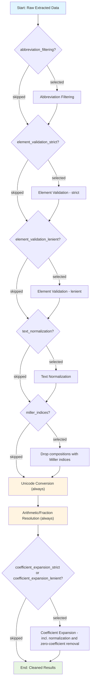

# Data Cleaning

The data cleaning module helps remove entries based on abbreviations, periodic elements and resolve arithmetic expressions, fractional compositions, etc. along with bracket standardization in extracted chemical formulas. It also includes advanced composition cleaning features to transform raw compositions into standardized, resolved forms.

## Basic Usage

```python
from comproscanner import ComProScanner

# Initialize scanner
scanner = ComProScanner(main_property_keyword="piezoelectric")

# Clean extracted data
scanner.clean_data(
    json_results_file="extracted_results.json"
)
```

## Parameters

### Required Parameters

#### :material-square-medium:`json_results_file` _(str)_

Path to the JSON results file containing extracted data that needs to be cleaned.

### Optional Parameters

#### :material-square-medium:`is_save_separate_results` _(bool)_

Whether to save separate cleaned results files.

#### :material-square-medium:`cleaned_json_results_file` _(str)_

Path to the cleaned JSON results file with articles having relevant composition-property data.

#### :material-square-medium:`is_save_composition_property_file` _(bool)_

Whether to save composition-property values to a separate file as a dictionary.

#### :material-square-medium:`composition_property_file` _(str)_

Path to the cleaned composition-property file containing a dictionary of composition-property data.

#### :material-square-medium:`cleaning_steps` _(Union[str, List[str]])_

Either the string `"all"` (default, every optional step enabled) or a list of step names selecting exactly which optional steps run:

- **`abbreviation_filtering`**: drops composition keys containing 2+ consecutive capital letters (abbreviations/junk keys, e.g. `"PVDF"`).
- **`element_validation_strict`**: keep only compositions whose key fully resolves to valid periodic-table element symbols.
- **`element_validation_lenient`**: a weaker companion of `element_validation_strict`. Instead of requiring the *entire* key to be pure elements, it keeps a composition as long as it contains at least one embedded formula fragment anywhere in the text. For example, `"Cellulose nanofibers/BaTiO3@TiO2/Polyvinylidene fluoride-(%)"` is kept because `"BaTiO3"` and `"TiO2"` each parse as elements, even though the rest is descriptive text. Only compositions with *no* recognizable formula fragment anywhere are dropped. If `element_validation_strict` is also selected, its stricter result wins: selecting both together gives no additional compositions beyond what `element_validation_strict` alone would keep.
- **`text_normalization`**: deterministic cleanup, strips leading/trailing whitespace, collapses runs of multiple spaces down to one, and title-cases descriptive word tokens (e.g. `"  Bi4Ti3O12  ultrathin with oxygen vacancies  "` → `"Bi4Ti3O12 Ultrathin with Oxygen Vacancies"`). Tokens containing digits (real formula segments) and tokens that fully parse as element symbols (e.g. `"NaCl"`) are left untouched, as are all-caps abbreviations (e.g. `"PVDF"`).
- **`miller_indices`**: drops compositions carrying a crystal-plane notation like `(002)`, `(111)`, `(100)`, etc. entirely, rather than stripping the notation and keeping the bare formula. Stripping and keeping would collapse distinct surface-orientation entries for the same material onto the same dict key, e.g. `"AlN (002)"` and `"AlN (110)"` would both become `"AlN"`, silently overwriting one value with the other when merged.
- **`coefficient_expansion_strict`**: expands leading/trailing/nested bracket coefficient patterns; internally also normalizes trailing zeros and removes zero-coefficient elements as part of expansion. Compositions left with any residual `()`, `[]`, or `*` afterward are dropped as unresolved.
- **`coefficient_expansion_lenient`**: a weaker companion of `coefficient_expansion_strict`. Performs the same bracket expansion, but spares compositions with *balanced* brackets (equal open/close counts, no stray `*`) whose bracket content is genuine text rather than a failed arithmetic expression, e.g. `"(Bi0.5Ag0.5)ZrO3-(as-sintered)"` is kept as `"Bi0.5Ag0.5ZrO3-(as-sintered)"` instead of being dropped as unresolved. If `coefficient_expansion_strict` is also selected, its stricter unresolved-filtering wins: selecting both together reverts to strict behavior.

Pass an empty list (`cleaning_steps=[]`) to skip all the optional steps.

#### :material-square-medium:`is_store_unresolved_compositions` _(bool)_

When `True`, logs a split statistics line showing `source`, `filtered`, `unresolved`, and `resolved` composition-property pair counts, and saves both filtered compositions (dropped by `abbreviation_filtering`, `element_validation_strict`, `element_validation_lenient`, or `miller_indices`) and unresolved compositions (still containing parentheses, brackets, or multiplication operators after cleaning) to a JSON file keyed by DOI. Requires `is_save_composition_property_file=True`.

#### :material-square-medium:`unresolved_compositions_file` _(str)_

Path to the JSON file where filtered and unresolved composition keys are saved, with `"filtered"` and `"unresolved"` as top-level keys and DOIs as sub-keys mapping to lists of `{"composition": ..., "reason": ...}` entries. `reason` names the step that dropped the composition (e.g. `"element_validation_strict"`, `"miller_indices"`, `"unresolved_brackets_or_operators"`). Used only when `is_store_unresolved_compositions=True`.

!!! info "Default Values"

    :material-square-small:**`is_save_separate_results`** = True<br>:material-square-small:**`cleaned_json_results_file`** = "cleaned_results.json"<br>:material-square-small:**`is_save_composition_property_file`** = True<br>:material-square-small:**`composition_property_file`** = "composition_property.json"<br>:material-square-small:**`cleaning_steps`** = "all"<br>:material-square-small:**`is_store_unresolved_compositions`** = False<br>:material-square-small:**`unresolved_compositions_file`** = "unresolved_compositions.json"

## Cleaning Process Flow

The data cleaning process follows this workflow:



### Process Stages

##### 1. Abbreviation Filtering _(optional — `abbreviation_filtering`)_

Drops composition keys containing 2+ consecutive capital letters (abbreviations, junk keys).

##### 2. Element Validation _(optional — `element_validation_strict`)_

Verifies compositions contain only valid periodic elements.

##### 3. Element Validation (Lenient) _(optional — `element_validation_lenient`)_

Keeps a composition if it contains at least one embedded formula fragment anywhere in the text (letters-only runs, split at digits/punctuation, that individually parse as element symbols), instead of requiring the whole key to be pure elements. Drops only compositions with no recognizable formula fragment anywhere. Has no additional effect when `element_validation_strict` is also selected: the stricter result wins.

##### 4. Text Normalization _(optional — `text_normalization`)_

Strips leading/trailing whitespace, collapses runs of multiple spaces down to one, and title-cases descriptive word tokens, leaving formula segments (tokens with digits, or tokens that fully parse as element symbols) and all-caps abbreviations untouched.

##### 5. Miller Indices Filtering _(optional — `miller_indices`)_

Drops any composition entry carrying a crystal plane notation like `(002)`, `(111)`, `(100)`, etc. entirely (not just the notation). Runs before Unicode/arithmetic resolution, see the following note.

!!! note "miller_indices drops entries, it does not strip-and-keep"

    `miller_indices` removes the **entire composition entry**, not just the `(002)`-style notation. Stripping the notation and keeping the bare formula would collapse distinct surface-orientation measurements for the same material onto the same dict key, e.g. `"AlN (002)": 3` and `"AlN (110)": 6` would both resolve to `"AlN"`, and merging the results (`_return_in_dict`) would silently overwrite one value with the other. Dropped keys are tracked in `filtered_compositions`, the same as `abbreviation_filtering`/`element_validation_strict` drops.

##### 6. Unicode Conversion _(always runs)_

Converts subscript Unicode characters to regular digits for standardization.

##### 7. Arithmetic Resolution _(always runs)_

Evaluates mathematical expressions and fractional compositions.

##### 8. Coefficient Expansion _(optional — `coefficient_expansion_strict` / `coefficient_expansion_lenient`)_

Expands coefficient patterns in chemical formulas, including:

- **Leading coefficients**: Multiplies all elements inside parentheses by leading coefficient
- **Trailing coefficients**: Multiplies all elements inside parentheses by trailing coefficient
- **Parenthetical coefficients**: Expands nested brackets with complex coefficient multiplication

Both `coefficient_expansion_strict` and `coefficient_expansion_lenient` trigger this same expansion logic. They differ only in what happens to compositions still carrying brackets/`*` afterward: `coefficient_expansion_strict` drops any of them as unresolved, while `coefficient_expansion_lenient` (when selected without `coefficient_expansion_strict`) spares compositions whose leftover brackets are balanced and contain genuine text rather than a failed arithmetic expression.

It also normalizes trailing zeros and removes zero-coefficient elements internally as part of expansion. There are no separate steps for those.


### Examples of Various Cleaning Steps

#### Element Validation

Keeps only compositions that resolve to elements, or, in the lenient variant, contain at least one embedded formula fragment:

| Input Composition | `element_validation_strict` alone | `element_validation_lenient` alone |
| --- | --- | --- |
| `BaTiO3` | kept, unchanged | kept, unchanged |
| `Cellulose nanofibers/BaTiO3@TiO2/Polyvinylidene fluoride-(%)` | dropped (tracked in `filtered_compositions`) | kept, unchanged |
| `beta-glycine-polydimethylsiloxane` | dropped (tracked in `filtered_compositions`) | dropped (tracked in `filtered_compositions`) |

Selecting both `element_validation_strict` and `element_validation_lenient` together reverts to the strict column above.

#### Text Normalization Examples

Normalizes whitespace and title-cases descriptive words; formula segments are untouched:

| Input Composition | Output Composition |
| --- | --- |
| `Bi4Ti3O12 ultrathin with oxygen vacancies` | `Bi4Ti3O12 Ultrathin with Oxygen Vacancies` |
| `  Bi4Ti3O12   ultrathin  with oxygen vacancies  ` | `Bi4Ti3O12 Ultrathin with Oxygen Vacancies` |
| `BaTiO3 XRD pattern` | `BaTiO3 XRD Pattern` |
| `NaCl` | `NaCl` (unchanged, fully parses as elements) |

#### Miller Indices Filtering

Drops any composition entry carrying a crystal plane notation entirely. It is not stripped down to the bare formula, since that would collapse distinct surface-orientation entries for the same material onto the same key:

| Input Composition | Result |
| ------------------ | ------ |
| `AlN (002)`        | dropped (tracked in `filtered_compositions`) |
| `ZnO (101)`        | dropped (tracked in `filtered_compositions`) |
| `BaTiO3`           | kept, unchanged |

#### Coefficient Expansion

Expands coefficients exactly like `coefficient_expansion_strict`, but keeps compositions whose leftover brackets are balanced and contain genuine text instead of dropping them as unresolved:

| Input Composition | `coefficient_expansion_strict` alone | `coefficient_expansion_lenient` alone |
| --- | --- | --- |
| `(Bi0.5Ag0.5)ZrO3-(as-sintered)` | dropped (tracked in `unresolved_compositions`) | `Bi0.5Ag0.5ZrO3-(as-sintered)` |
| `0.03*(Bi0.5Ag0.5)ZrO3` (stray `*` never expanded) | dropped (tracked in `unresolved_compositions`) | dropped (tracked in `unresolved_compositions`); a stray `*` is always treated as a genuine failure |
| `0.7(K0.48Na0.52NbO3)` | `K0.336Na0.364Nb0.7O2.1` | `K0.336Na0.364Nb0.7O2.1` |

Selecting both `coefficient_expansion_strict` and `coefficient_expansion_lenient` together reverts to the strict column above.

!!! tip "Original vs Resolved Compositions"

    The optional cleaning steps transform raw extracted compositions into standardized, resolved forms. Both versions can be preserved for traceability in custom implementations using the `DataCleaner` class directly with the `cleaning_steps` parameter. This allows you to maintain both the original extracted composition (for reference and validation) and the fully resolved composition (for analysis and database storage).

## Next Steps

- Learn about [Evaluation](evaluation/overview.md)
- Explore [Visualization](visualization/overview.md)
- Configure [Advanced RAG](../rag-config.md)
