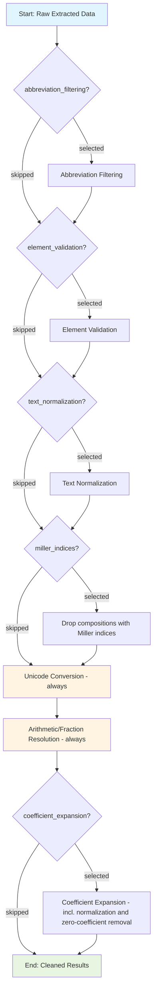

# Data Cleaning

The data cleaning module helps remove entries based on abbreviations, periodic elements and resolve arithmetic expressions, fractional compositions, etc. along with bracket standardization in extracted chemical formulas. It also includes advanced composition cleaning features to transform raw compositions into standardized, resolved forms.

## Basic Usage

```python
from comproscanner import ComProScanner

# Initialize scanner
scanner = ComProScanner(main_property_keyword="piezoelectric")

# Clean extracted data
scanner.clean_data(
    json_results_file="extracted_results.json"
)
```

## Parameters

### Required Parameters

#### :material-square-medium:`json_results_file` _(str)_

Path to the JSON results file containing extracted data that needs to be cleaned.

### Optional Parameters

#### :material-square-medium:`is_save_separate_results` _(bool)_

Whether to save separate cleaned results files.

#### :material-square-medium:`cleaned_json_results_file` _(str)_

Path to the cleaned JSON results file with articles having relevant composition-property data.

#### :material-square-medium:`is_save_composition_property_file` _(bool)_

Whether to save composition-property values to a separate file as a dictionary.

#### :material-square-medium:`composition_property_file` _(str)_

Path to the cleaned composition-property file containing a dictionary of composition-property data.

#### :material-square-medium:`cleaning_steps` _(Union[str, List[str]])_

Either the string `"all"` (default, every optional step enabled) or a list of step names selecting exactly which optional steps run:

- **`abbreviation_filtering`** — drops composition keys containing 2+ consecutive capital letters (abbreviations/junk keys, e.g. `"PVDF"`).
- **`element_validation`** — keep only compositions whose key fully resolves to valid periodic-table element symbols.
- **`text_normalization`** — deterministic cleanup: strips leading/trailing whitespace, collapses runs of multiple spaces down to one, and title-cases descriptive word tokens (e.g. `"  Bi4Ti3O12  ultrathin with oxygen vacancies  "` → `"Bi4Ti3O12 Ultrathin with Oxygen Vacancies"`). Tokens containing digits (real formula segments) and tokens that fully parse as element symbols (e.g. `"NaCl"`) are left untouched, as are all-caps abbreviations (e.g. `"PVDF"`). 
- **`miller_indices`** — drops compositions carrying a crystal-plane notation like `(002)`, `(111)`, `(100)`, etc. entirely, rather than stripping the notation and keeping the bare formula. Stripping and keeping would collapse distinct surface-orientation entries for the same material onto the same dict key — e.g. `"AlN (002)"` and `"AlN (110)"` would both become `"AlN"`, silently overwriting one value with the other when merged.
- **`coefficient_expansion`** — expands leading/trailing/nested bracket coefficient patterns; internally also normalizes trailing zeros and removes zero-coefficient elements as part of expansion.

Pass an empty list (`cleaning_steps=[]`) to skip all the optional steps.

#### :material-square-medium:`is_store_unresolved_compositions` _(bool)_

When `True`, logs a split statistics line showing `source`, `filtered`, `unresolved`, and `resolved` composition-property pair counts, and saves both filtered compositions (dropped by `abbreviation_filtering`, `element_validation`, or `miller_indices`) and unresolved compositions (still containing parentheses, brackets, or multiplication operators after cleaning) to a JSON file keyed by DOI. Requires `is_save_composition_property_file=True`.

#### :material-square-medium:`unresolved_compositions_file` _(str)_

Path to the JSON file where filtered and unresolved composition keys are saved, with `"filtered"` and `"unresolved"` as top-level keys and DOIs as sub-keys mapping to lists of composition strings. Used only when `is_store_unresolved_compositions=True`.

!!! info "Default Values"

    :material-square-small:**`is_save_separate_results`** = True<br>:material-square-small:**`cleaned_json_results_file`** = "cleaned_results.json"<br>:material-square-small:**`is_save_composition_property_file`** = True<br>:material-square-small:**`composition_property_file`** = "composition_property.json"<br>:material-square-small:**`cleaning_steps`** = "all"<br>:material-square-small:**`is_store_unresolved_compositions`** = False<br>:material-square-small:**`unresolved_compositions_file`** = "unresolved_compositions.json"

## Cleaning Process Flow

The data cleaning process follows this workflow:



!!! note "miller_indices drops entries, it does not strip-and-keep"

    `miller_indices` removes the **entire composition entry**, not just the `(002)`-style notation. Stripping the notation and keeping the bare formula would collapse distinct surface-orientation measurements for the same material onto the same dict key — e.g. `"AlN (002)": 3` and `"AlN (110)": 6` would both resolve to `"AlN"`, and merging the results (`_return_in_dict`) would silently overwrite one value with the other. Dropping both entirely avoids that data loss; dropped keys are tracked in `filtered_compositions`, the same as `abbreviation_filtering`/`element_validation` drops.

    This detection must also happen **before** the mandatory arithmetic/bracket resolution: a bare 3-digit parenthetical like `(002)` is indistinguishable from a "coefficient bracket" to that resolver and to `coefficient_expansion`'s own bracket-stripping logic — left unremoved, either would fold its digits straight into the preceding element (e.g. `AlN (002)` → `AlN2`/`AlN 002`). Running the `miller_indices` check first, while the brackets are still in their original shape, avoids this. If `miller_indices` is **not** selected, a bare 3-digit-only bracket is instead left untouched by both of those steps and is dropped later as an unresolved composition, the same as any other leftover bracket — so it is never silently merged into a wrong formula either way.

### Process Stages

#### 1. Abbreviation Filtering _(optional — `abbreviation_filtering`)_

Drops composition keys containing 2+ consecutive capital letters (abbreviations, junk keys).

#### 2. Element Validation _(optional — `element_validation`)_

Verifies compositions contain only valid periodic elements.

#### 3. Text Normalization _(optional — `text_normalization`)_

Strips leading/trailing whitespace, collapses runs of multiple spaces down to one, and title-cases descriptive word tokens, leaving formula segments (tokens with digits, or tokens that fully parse as element symbols) and all-caps abbreviations untouched.

#### 4. Miller Indices Filtering _(optional — `miller_indices`)_

Drops any composition entry carrying a crystal plane notation like `(002)`, `(111)`, `(100)`, etc. entirely (not just the notation). Runs before Unicode/arithmetic resolution — see the note above.

#### 5. Unicode Conversion _(always runs)_

Converts subscript Unicode characters to regular digits for standardization.

#### 6. Arithmetic Resolution _(always runs)_

Evaluates mathematical expressions and fractional compositions.

#### 7. Coefficient Expansion _(optional — `coefficient_expansion`)_

Expands coefficient patterns in chemical formulas, including:

- **Leading coefficients**: Multiplies all elements inside parentheses by leading coefficient
- **Trailing coefficients**: Multiplies all elements inside parentheses by trailing coefficient
- **Parenthetical coefficients**: Expands nested brackets with complex coefficient multiplication

It also normalizes trailing zeros and removes zero-coefficient elements internally as part of expansion — there are no separate steps for those.

## Text Normalization Examples

Normalizes whitespace and title-cases descriptive words; formula segments are untouched:

| Input Composition | Output Composition |
| --- | --- |
| `Bi4Ti3O12 ultrathin with oxygen vacancies` | `Bi4Ti3O12 Ultrathin with Oxygen Vacancies` |
| `  Bi4Ti3O12   ultrathin  with oxygen vacancies  ` | `Bi4Ti3O12 Ultrathin with Oxygen Vacancies` |
| `BaTiO3 XRD pattern` | `BaTiO3 XRD Pattern` |
| `NaCl` | `NaCl` (unchanged — fully parses as elements) |

## Advanced Cleaning Examples

### Miller Indices Filtering

Drops any composition entry carrying a crystal plane notation entirely — it is not stripped down to the bare formula, since that would collapse distinct surface-orientation entries for the same material onto the same key:

| Input Composition | Result |
| ------------------ | ------ |
| `AlN (002)`        | dropped (tracked in `filtered_compositions`) |
| `ZnO (101)`        | dropped (tracked in `filtered_compositions`) |
| `BaTiO3`           | kept, unchanged |

### Coefficient Expansion

#### Leading Coefficient Expansion

Multiplies all elements inside parentheses by the coefficient before the opening bracket:

| Input Formula          | Output Formula      |
| ---------------------- | ------------------- |
| `0.7(K0.48Na0.52NbO3)` | `K0.336Na0.364NbO3` |
| `(0.15)Dy2O3`          | `Dy0.3O0.45`        |

#### Trailing Coefficient Expansion

Multiplies all elements inside parentheses by the coefficient after the closing bracket:

| Input Formula           | Output Formula      |
| ----------------------- | ------------------- |
| `(K0.5Na0.5)(0.97)NbO3` | `K0.485Na0.485NbO3` |
| `(Bi0.5Na0.5)0.94TiO3`  | `Bi0.47Na0.47TiO3`  |

#### Parenthetical Coefficient Expansion

Handles nested brackets and complex coefficient multiplication:

| Input Formula                 | Output Formula          |
| ----------------------------- | ------------------------ |
| `[(K0.5Na0.5)0.96Bi0.04]NbO3` | `K0.48Na0.48Bi0.04NbO3` |
| `[Ba0.85Ca0.15]0.99TiO3`      | `Ba0.8415Ca0.1485TiO3`  |

Coefficient expansion also normalizes trailing zeros (`Pb0.90La0.10` → `Pb0.9La0.1`) and removes zero-coefficient elements (`BaTiZr0O3` → `BaTiO3`) internally as part of the same step.

!!! tip "Original vs Resolved Compositions"

    The optional cleaning steps transform raw extracted compositions into standardized, resolved forms. Both versions can be preserved for traceability in custom implementations using the `DataCleaner` class directly with the `cleaning_steps` parameter. This allows you to maintain both the original extracted composition (for reference and validation) and the fully resolved composition (for analysis and database storage).

## Next Steps

- Learn about [Evaluation](evaluation/overview.md)
- Explore [Visualization](visualization/overview.md)
- Configure [Advanced RAG](../rag-config.md)
