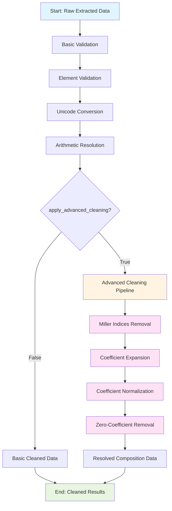

# Data Cleaning

The data cleaning module helps remove entries based on abbreviations, periodic elements and resolve arithmetic expressions, fractional compositions, etc. along with bracket standardization in extracted chemical formulas. It also includes advanced composition cleaning features to transform raw compositions into standardized, resolved forms.

## Basic Usage

```python
from comproscanner import ComProScanner

# Initialize scanner
scanner = ComProScanner(main_property_keyword="piezoelectric")

# Clean extracted data
scanner.clean_data(
    json_results_file="extracted_results.json"
)
```

## Parameters

### Required Parameters

#### :material-square-medium:`json_results_file` _(str)_

Path to the JSON results file containing extracted data that needs to be cleaned.

### Optional Parameters

#### :material-square-medium:`is_save_separate_results` _(bool)_

Whether to save separate cleaned results files.

#### :material-square-medium:`cleaned_json_results_file` _(str)_

Path to the cleaned JSON results file with articles having relevant composition-property data.

#### :material-square-medium:`is_save_composition_property_file` _(bool)_

Whether to save composition-property values to a separate file as a dictionary.

#### :material-square-medium:`composition_property_file` _(str)_

Path to the cleaned composition-property file containing a dictionary of composition-property data.

#### :material-square-medium:`cleaning_strategy` _(str)_

The cleaning strategy to be used. It can be either `full` or `basic`. While comprehensive cleaning including abbreviation removal, arithmetic resolution, bracket standardization, etc., are done for both strategies, the `full` strategy ensures entries with only periodic elements in the composition.

#### :material-square-medium:`apply_advanced_cleaning` _(bool)_

Flag to indicate if advanced composition cleaning transformations should be applied. When `True`, applies all advanced cleaning processes including Miller indices removal, coefficient expansion, normalization, and zero-coefficient element removal. When `False`, returns basic cleaned compositions only.

#### :material-square-medium:`is_store_unresolved_compositions` _(bool)_

When `True`, logs a split statistics line showing `source`, `filtered`, `unresolved`, and `resolved` composition-property pair counts, and saves both filtered compositions (dropped by invalid-key or element-validation checks) and unresolved compositions (still containing parentheses, brackets, or multiplication operators after the full cleaning pipeline) to a JSON file keyed by DOI. Requires `is_save_composition_property_file=True`.

#### :material-square-medium:`unresolved_compositions_file` _(str)_

Path to the JSON file where filtered and unresolved composition keys are saved, with `"filtered"` and `"unresolved"` as top-level keys and DOIs as sub-keys mapping to lists of composition strings. Used only when `is_store_unresolved_compositions=True`.

!!! info "Default Values"

    :material-square-small:**`is_save_separate_results`** = True<br>:material-square-small:**`cleaned_json_results_file`** = "cleaned_results.json"<br>:material-square-small:**`is_save_composition_property_file`** = True<br>:material-square-small:**`composition_property_file`** = "composition_property.json"<br>:material-square-small:**`cleaning_strategy`** = "full"<br>:material-square-small:**`apply_advanced_cleaning`** = True<br>:material-square-small:**`is_store_unresolved_compositions`** = False<br>:material-square-small:**`unresolved_compositions_file`** = "unresolved_compositions.json"

## Cleaning Process Flow

The data cleaning process follows this workflow:



### Process Stages

#### 1. Basic Validation

Removes invalid keys, abbreviations, and special characters from compositions.

#### 2. Element Validation

Verifies compositions contain only valid periodic elements (for `full` strategy only).

#### 3. Unicode Conversion

Converts subscript Unicode characters to regular digits for standardization.

#### 4. Arithmetic Resolution

Evaluates mathematical expressions and fractional compositions.

#### 5. Advanced Cleaning Pipeline

When `apply_advanced_cleaning=True`, the following sub-processes are executed sequentially:

##### Miller Indices Removal

Removes crystal plane notations like `(002)`, `(111)`, `(100)`, etc. from chemical formulas.

##### Coefficient Expansion

Expands coefficient patterns in chemical formulas including:

- **Leading coefficients**: Multiplies all elements inside parentheses by leading coefficient
- **Trailing coefficients**: Multiplies all elements inside parentheses by trailing coefficient
- **Parenthetical coefficients**: Expands nested brackets with complex coefficient multiplication

##### Coefficient Normalization

Removes trailing zeros from element coefficients for cleaner representation.

##### Zero-Coefficient Removal

Removes elements with coefficient values of 0 or 0.0 from formulas.

## Advanced Cleaning Examples

### Miller Indices Removal

Removes crystal plane notations from chemical formulas:

| Input Formula | Output Formula |
| ------------- | -------------- |
| `AlN (002)`   | `AlN`          |
| `ZnO (101)`   | `ZnO`          |

### Coefficient Expansion

#### Leading Coefficient Expansion

Multiplies all elements inside parentheses by the coefficient before the opening bracket:

| Input Formula          | Output Formula      |
| ---------------------- | ------------------- |
| `0.7(K0.48Na0.52NbO3)` | `K0.336Na0.364NbO3` |
| `(0.15)Dy2O3`          | `Dy0.3O0.45`        |

#### Trailing Coefficient Expansion

Multiplies all elements inside parentheses by the coefficient after the closing bracket:

| Input Formula           | Output Formula      |
| ----------------------- | ------------------- |
| `(K0.5Na0.5)(0.97)NbO3` | `K0.485Na0.485NbO3` |
| `(Bi0.5Na0.5)0.94TiO3`  | `Bi0.47Na0.47TiO3`  |

#### Parenthetical Coefficient Expansion

Handles nested brackets and complex coefficient multiplication:

| Input Formula                 | Output Formula          |
| ----------------------------- | ----------------------- |
| `[(K0.5Na0.5)0.96Bi0.04]NbO3` | `K0.48Na0.48Bi0.04NbO3` |
| `[Ba0.85Ca0.15]0.99TiO3`      | `Ba0.8415Ca0.1485TiO3`  |

### Coefficient Normalization

Removes trailing zeros from element coefficients:

| Input Formula      | Output Formula |
| ------------------ | -------------- |
| `Pb0.90La0.10`     | `Pb0.9La0.1`   |
| `Zr0.200Ti0.800O2` | `Zr0.2Ti0.8O2` |

### Zero-Coefficient Element Removal

Removes elements with zero coefficients:

| Input Formula    | Output Formula |
| ---------------- | -------------- |
| `BaTiZr0O3`      | `BaTiO3`       |
| `K0.5Na0.5Nb0O3` | `K0.5Na0.5O3`  |

!!! tip "Original vs Resolved Compositions"

    The advanced cleaning process transforms raw extracted compositions into standardized, resolved forms. Both versions can be preserved for traceability in custom implementations using the `DataCleaner` class directly with the `apply_advanced_cleaning` parameter. This allows you to maintain both the original extracted composition (for reference and validation) and the fully resolved composition (for analysis and database storage).

## Next Steps

- Learn about [Evaluation](evaluation/overview.md)
- Explore [Visualization](visualization/overview.md)
- Configure [Advanced RAG](../rag-config.md)
