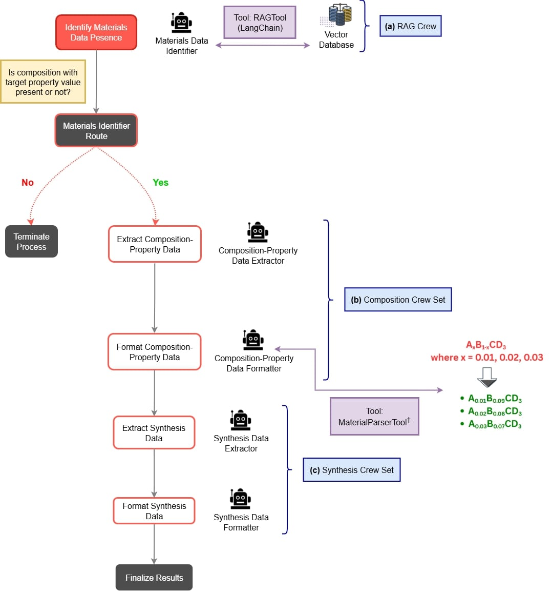

# Data Extraction

The data extraction module uses [CrewAI](https://crewai.com) framework with specialized agents to extract composition-property relationships and synthesis data in a structured manner.

## Basic Usage

```python
scanner.extract_composition_property_data(
    main_extraction_keyword="d33"
)
```

## Parameters

### Required Parameters

#### :material-square-medium:`main_extraction_keyword` _(str)_

The specific property to extract from the articles, e.g., "d33" for piezoelectric coefficient.

### Optional Parameters

#### :material-square-medium:`start_row` _(int)_

Row number from the metadata CSV file to start processing from (for resuming).

#### :material-square-medium:`num_rows` _(int)_

Number of rows to process the articles for.

#### :material-square-medium:`is_test_data_preparation` _(bool)_

Flag to indicate if test data preparation is to be performed. When True, the function will prepare test data by collecting DOIs with composition-property data.

#### :material-square-medium:`test_doi_list_file` _(str)_

Path to a text file containing the test DOIs. Required if _is_test_data_preparation_ is True. This file will store DOIs that contain composition-property data for evaluation purposes.

#### :material-square-medium:`total_test_data` _(int)_

Total number of test articles to collect when _is_test_data_preparation_ is True. The function will stop processing once this many DOIs with composition data are found.

#### :material-square-medium:`is_only_consider_test_doi_list` _(bool)_

Flag to indicate if only the test DOI list should be considered for processing. Should be set to True if the _test_doi_list_file_ already contains the required number of test DOIs and you want to process only those DOIs.

#### :material-square-medium:`test_random_seed` _(int)_

Random seed for test data preparation to ensure same DOIs are selected for reproducibility.

#### :material-square-medium:`checked_doi_list_file` _(str)_

Path to a text file containing list of DOIs which have been processed already. Used to avoid reprocessing the same papers.

#### :material-square-medium:`json_results_file` _(str)_

Path to the JSON results file where extracted data will be saved.

#### :material-square-medium:`csv_results_file` _(str)_

Path to the CSV results file where extracted data will be saved if _is_save_csv_ is True.

#### :material-square-medium:`is_save_csv` _(bool)_

Flag to indicate if the results should be saved in CSV format in addition to JSON.

#### :material-square-medium:`is_extract_synthesis_data` _(bool)_

Flag to indicate if the synthesis data (methods, precursors, characterization techniques) should be extracted along with composition-property data.

#### :material-square-medium:`is_save_relevant` _(bool)_

Flag to indicate if only papers with composition-property data should be saved. If True, only saves papers that contain composition data. If False, saves all processed papers regardless of whether they contain composition data.

#### :material-square-medium:`materials_data_identifier_query` _(str)_

Custom query to identify if materials data is present in the paper. **Must be designed to expect a 'yes/no' answer.** If not provided, defaults to a query asking about material chemical composition and the corresponding property value from text. If text-RAG returns `no`, the flow also checks saved figures with a VLM as a fallback before deciding.

#### :material-square-medium:`model` _(str)_

Name of the LLM model to use for extraction. Supports various providers (OpenAI, Anthropic, Google, etc.).

#### :material-square-medium:`api_base` _(str)_

Base URL for standard API endpoints when using custom API services.

#### :material-square-medium:`base_url` _(str)_

Base URL for the model service, used for custom or local model deployments.

#### :material-square-medium:`api_key` _(str)_

API key for the model service. Can also be set via environment variables for specific providers.

#### :material-square-medium:`output_log_folder` _(str)_

Base folder path to save detailed logs for each processed paper. Logs will be saved in _{output_log_folder}/{doi}/_ subdirectory. Logs will be in JSON format if _is_log_json_ is True, otherwise plain text.

#### :material-square-medium:`is_log_json` _(bool)_

Flag to indicate if logs should be saved in JSON format. If True, logs will be structured as JSON objects. If False, logs will be plain text.

#### :material-square-medium:`task_output_folder` _(str)_

Base folder path to save output files for each processed paper. Output files will be saved in _{task_output_folder}/{doi}/_ subdirectory.

#### :material-square-medium:`verbose` _(bool)_

Flag to enable verbose output in the terminal during processing.

#### :material-square-medium:`temperature` _(float)_

Sampling temperature parameter for text generation - controls randomness. Lower values (0.0-0.3) make output more deterministic, higher values (0.7-1.0) make it more creative and diverse.

#### :material-square-medium:`top_p` _(float)_

Nucleus sampling parameter for text generation - controls diversity by considering only the top p probability mass. Lower values focus on high-probability tokens, higher values allow more diversity.

#### :material-square-medium:`timeout` _(int)_

Request timeout in seconds for API calls to the LLM.

#### :material-square-medium:`frequency_penalty` _(float)_

Frequency penalty for text generation to reduce repetition. Higher values discourage repetition, while lower values allow it.

#### :material-square-medium:`max_tokens` _(int)_

Maximum number of tokens for LLM completion responses.

#### :material-square-medium:`rag_db_path` _(str)_

Custom path to the vector database used for Retrieval-Augmented Generation (RAG) tool.

#### :material-square-medium:`embedding_model` _(str)_

Name of the embedding model to use for reading vector database for RAG.

#### :material-square-medium:`rag_chat_model` _(str)_

Name of the chat model to use for RAG responses during extraction.

#### :material-square-medium:`rag_max_tokens` _(int)_

Maximum number of tokens for RAG chat model responses.

#### :material-square-medium:`rag_top_k` _(int)_

Number of top relevant documents to retrieve from the vector database for RAG.

#### :material-square-medium:`rag_base_url` _(str)_

Base URL for the RAG model service, used for custom or local model deployments.

#### :material-square-medium:`vlm_model` _(str)_

Name of the vision LLM model used by `GraphExtractorTool` to read composition-property values from saved figures. Supports any provider prefix supported by [LiteLLM](https://docs.litellm.ai/docs/providers) (e.g., `gemini/...`, `openai/...`, `anthropic/...`).

#### :material-square-medium:`related_figures_base_path` _(str)_

Path to the directory where figures were saved during article processing. Defaults to `results/extracted_data/{main_property_keyword}/related_figures`.

#### :material-square-medium:`formula_instruction` _(str)_

Custom instruction passed to the `Equation Tool` that guides the LLM when determining whether doping produces a single-phase compound and deriving the general doped chemical formula. When `None`, the tool uses its built-in default instruction which covers a broad range of crystal structures (perovskites, spinels, fluorites, rocksalts, etc.) and charge-compensation mechanisms. Provide a custom string here to tailor the formula-derivation logic for a specific materials system or notation convention.

#### :material-square-medium:`equation_model` _(str)_

Explicit LiteLLM model name for `Equation Tool`. Use this when you want deterministic model control for formula derivation (for example, `openai/gpt-5.4-mini` or `gemini/gemini-3-flash-preview`). If `None`, the tool first checks `EQUATION_TOOL_MODEL` from environment variables, then falls back to API-key based auto-selection.

#### :material-square-medium:`**flow_optional_args` _(dict)_

Optional arguments for the MaterialsFlow class to customize extraction behavior by giving additional notes, examples, and allowed methods/techniques.

!!! info "Default Values"

    :material-square-small:**`start_row`** = 0<br>:material-square-small:**`num_rows`** = All rows<br>:material-square-small:**`is_test_data_preparation`** = False<br>:material-square-small:**`test_doi_list_file`** = None<br>:material-square-small:**`total_test_data`** = 50<br>:material-square-small:**`is_only_consider_test_doi_list`** = False<br>:material-square-small:**`test_random_seed`** = 42<br>:material-square-small:**`checked_doi_list_file`** = "checked_dois.txt"<br>:material-square-small:**`json_results_file`** = "results.json"<br>:material-square-small:**`csv_results_file`** = "results.csv"<br>:material-square-small:**`is_extract_synthesis_data`** = True<br>:material-square-small:**`is_save_csv`** = False<br>:material-square-small:**`is_save_relevant`** = True<br>:material-square-small:**`materials_data_identifier_query`** = "Is there any material chemical composition and corresponding {main_property_keyword} value mentioned in the paper? Give one word answer. Either yes or no."<br>:material-square-small:**`model`** = "gpt-4o-mini"<br>:material-square-small:**`api_base`** = None<br>:material-square-small:**`base_url`** = None<br>:material-square-small:**`api_key`** = None<br>:material-square-small:**`output_log_folder`** = None<br>:material-square-small:**`is_log_json`** = False<br>:material-square-small:**`task_output_folder`** = None<br>:material-square-small:**`verbose`** = True<br>:material-square-small:**`temperature`** = 0.1<br>:material-square-small:**`top_p`** = 0.9<br>:material-square-small:**`timeout`** = 60<br>:material-square-small:**`frequency_penalty`** = None<br>:material-square-small:**`max_tokens`** = 2048<br>:material-square-small:**`rag_db_path`** = "db"<br>:material-square-small:**`embedding_model`** = "huggingface:thellert/physbert_cased"<br>:material-square-small:**`rag_chat_model`** = "gpt-4o-mini"<br>:material-square-small:**`rag_max_tokens`** = 512<br>:material-square-small:**`rag_top_k`** = 3<br>:material-square-small:**`rag_base_url`** = None<br>:material-square-small:**`vlm_model`** = "gemini/gemini-3-flash-preview"<br>:material-square-small:**`related_figures_base_path`** = "results/extracted_data/{main_property_keyword}/related_figures"<br>:material-square-small:**`formula_instruction`** = None (uses built-in default instruction)<br>:material-square-small:**`equation_model`** = None (uses `EQUATION_TOOL_MODEL` env var if set; otherwise API-key based auto-selection)<br>:material-square-small:**`flow_optional_args`** = {}

## Extraction Agents

The extraction process involves five specialized agents working in sequence to identify and extract relevant data from the articles based on the specified property keyword.

### 1. Materials Data Identifier (1️⃣)

**Purpose**: `Materials Data Identifier` first uses text RAG to determine if target material composition/property data exists. If text RAG returns `no`, it then checks saved figures with the configured VLM to catch graph-only evidence (for example, doping concentration on one axis and property values on the other).

**Default Query**:

```
Is there any material chemical composition and corresponding {main_property_keyword} value mentioned in the paper? Give one word answer. Either yes or no.
```

**Output**: Yes/No

**Used Tools**:

!!! example "RAG Tool"

    Retrieval-Augmented Generation (RAG) is used to query the vector database of property-mentioned articles which were created during article processing to provide relevant context to the LLM for accurate identification.

!!! example "VLM Figure Fallback"

    When the RAG result is `no`, the flow checks saved `.jpg` figures for the DOI using the configured `vlm_model`. Graphs are treated as relevant even when full formulas are absent, as long as property values are associated with composition variables or doping concentrations (e.g., `x`, mol%, at%).

### 2. Composition-Property Data Extractor (2️⃣) & Composition-Property Data Formatter (3️⃣)

**Purpose**: `Composition-Property Data Extractor` extracts compositions and property values along with their corresponding unit and material family from the article text. It first calls `Equation Tool` to determine whether doping produces a single-phase compound and to retrieve the general doped formula, then calls `Graph Extractor Tool` to supplement text-derived values with data read from saved figures. Finally, `Composition-Property Data Formatter` formats the extracted data into structured JSON similar to the following example.

**Output Format**:

```json
{
  "composition_data": {
    "compositions_property_values": {
      "Eu1.90Dy0.10Ge2O7": 0.66,
      "Eu1.90La0.10Ge2O7": 0.36,
      "Eu1.90Ho0.10Ge2O7": 0.62
    },
    "property_unit": "pC/N",
    "family": "RE2B2O7"
  }
}
```

**Used Tools**:

!!! example "Equation Tool"

    Equation Tool is used **first** by the `Composition-Property Data Extractor` agent. It sends the paper text — along with any crystal structure characterisation figures saved for the DOI (XRD, SEM, TEM, Rietveld, etc.) — to an LLM and applies a multi-step reasoning procedure to:

    1. Identify the host crystal structure and sublattice occupancies.
    2. Check XRD/diffraction evidence for single-phase formation.
    3. Identify the dopant, its valence, and substitution site.
    4. Determine the charge compensation mechanism (cation vacancies, anion vacancies, anion stoichiometry adjustment, etc.).
    5. Construct and charge-balance the general doped formula in algebraic form.

    If the paper confirms a single-phase compound the tool returns the general formula (e.g. `(Na_0.53(1-x)K_0.404(1-x)Li_0.066(1-x)Ca_x)(Nb_0.92(1-x)Sb_0.08(1-x)Al_2x)O3`). If secondary phases or phase separation are reported it returns the literal string `single compound is not being synthesized`, and the agent falls back to text-only extraction.

    **LLM selection** — the tool automatically picks the model based on which API key is found in the environment, in this priority order:

    | Priority | Environment Variable | Model used |
    |----------|---------------------|------------|
    | 1 (default) | `ANTHROPIC_API_KEY` | `anthropic/claude-sonnet-4-6` |
    | 2 | `GEMINI_API_KEY` | `gemini/gemini-3-flash-preview` |
    | 3 | `OPENAI_API_KEY` | `openai/gpt-5.4-mini` |
    | 4 | `DEEPSEEK_API_KEY` | `deepseek/deepseek-chat` |
    | 5 | `OPENROUTER_API_KEY` | `openrouter/google/gemini-2.0-flash` |
    | 6 | `TOGETHER_API_KEY` | `together_ai/meta-llama/Llama-3.3-70B-Instruct-Turbo` |
    | 7 | `COHERE_API_KEY` | `cohere/command-r-plus` |
    | 8 | `FIREWORKS_API_KEY` | `fireworks_ai/accounts/fireworks/models/llama-v3p1-70b-instruct` |

    Model precedence is:
    1. `equation_model` argument in `extract_composition_property_data()`
    2. `EQUATION_TOOL_MODEL` environment variable
    3. API-key based auto-selection table above

    The default instruction can be replaced with a domain-specific one via the `formula_instruction` parameter of `extract_composition_property_data()`.

!!! example "Graph Extractor Tool"

    Graph Extractor Tool is used by the `Composition-Property Data Extractor` agent **after** the Equation Tool when figures have been saved during article processing. It scans the saved figure directory for the given DOI, sends each image to a configurable vision LLM (default: `gemini/gemini-3-flash-preview`), and extracts composition-property value pairs directly from graphs and charts. The extracted data is returned as structured JSON and used alongside the text-based extraction to improve coverage of graphical data. For graph extraction, the figures are saved during article processing (using `caption_keywords` in `process_articles`) and specify the VLM model at extraction time:

!!! example "MaterialParser Tool"

    MaterialParser Tool is used by the `Composition-Property Data Formatter` agent. Material-parser is a deep learning model, developed by [Foppiano et al.](https://doi.org/10.1080/27660400.2022.2153633), specifically designed for parsing chemical compositions with multiple fractions denoted as variables e.g., $Na_{(1-x)}Li_xTiO_3$ where x = 0.1, 0.3, and 0.4. This tool incorporates the material-parser model to accurately extract and standardize complex chemical compositions with variable fractions into the final compositions. For e.g., the previous example would be parsed into three distinct compositions: **Na(0.9)Li(0.1)TiO3**, **Na(0.7)Li(0.3)TiO3**, and **Na(0.6)Li(0.4)TiO3**.

### 3. Synthesis Data Extractor (4️⃣) & Synthesis Data Formatter (5️⃣)

**Purpose**: `Synthesis Data Extractor` extracts synthesis related data including method, precursors, steps, and characterization techniques from the article text and finally `Synthesis Data Formatter` formats the extracted data into structured JSON similar to the following example.

**Output Format**:

```json
{
  "synthesis_data": {
    "method": "solid-state reaction",
    "precursors": ["Eu2O3", "GeO2", "Dy2O3", "La2O3", "Ho2O3"],
    "steps": [
      "Starting materials Eu2O3, GeO2, Dy2O3, La2O3 and Ho2O3 were combined in stoichiometric ratios with each dopant at 5 mol%.",
      "Samples were first heated at 800°C for 2 hours in pure alumina crucibles under open atmosphere.",
      "Materials were then heated to 1150°C for 10 hours followed by slow cooling.",
      "Resulting materials were ground into powder for further characterization.",
      "Ceramic discs were formed from obtained powder materials with 1 mm thickness and 10 mm diameter.",
      "Ceramic discs were compacted using uniaxial pressing under 250 MPa pressure with 2 wt% of 5 wt% PVA aqueous solution as binder.",
      "Samples were heated at 600°C for 30 minutes to eliminate organic additives.",
      "Sintering was conducted at 1400°C for 4 hours.",
      "Silver paste was applied to disc surfaces and fired at 650°C for 1 hour to form surface electrodes.",
      "Electric field of 9-18 kV/mm was applied in silicon oil bath at 120°C for 30 minutes followed by 24-hour aging."
    ],
    "characterization_techniques": [
      "TG/DTA",
      "XRD",
      "SEM",
      "EDX",
      "photoluminescence spectroscopy",
      "LCR meter",
      "d33 meter"
    ]
  }
}
```

### Extraction Workflow Diagram

{ width="600" }

## Flow Optional Arguments

Customize extraction behavior by providing additional examples, notes, and allowed methods/techniques via `flow_optional_args` dictionary where values are formatted strings or lists of strings.:

```python
flow_optional_args = {
    "expected_composition_property_example": f"""
    {{
      "compositions":
      {{
        "Ba0.99Ca0.01Ti0.68Zr0.32O3": 375,
        "Ba0.98Ca0.02Ti0.78Zr0.22O3": 350,
        "Ba0.97Ca0.03Ti0.88Zr0.12O3": 325,
        "Ba0.96Ca0.04Ti0.98Zr0.02O3": 300
      }},
      "property_unit": "pC/N",
      "family": "BaTiO3"
    }}""",
    expected_variable_composition_property_example: f"""
    {{
    "compositions":
      {{
        "0.5NaNbO3": 375,
        "(1-x)Na0.2K2(x)Bi0.5TiO3 - (y)NaNbO3 where x=0, y=0.5": 350,
        "(1-x)Na0.2K2(x)Bi0.5TiO3 - (y)NaNbO3 where x=0.1, y=0.4": 325,
        "(1-x)Na0.2K2(x)Bi0.5TiO3 - (y)NaNbO3 where x=0.2, y=0.3": 375,
        "(1-x)Na0.2K2(x)Bi0.5TiO3 - (y)NaNbO3 where x=0.3, y=0.1": 425
      }},
      "property_unit": "pC/N",
      "family": "NaNbO3"
    }}"""
    "composition_property_extraction_task_notes": [
        "Write complete chemical formulas",
        "Include crystal structure if mentioned",
        "Note measurement conditions"
    ],
    "synthesis_extraction_task_notes": [
        "Use short method names",
        "List all precursors",
        "Include processing temperatures"
    ],
    "allowed_synthesis_methods": [
        "Solid-state reaction",
        "Sol-gel",
        "Hydrothermal",
        "Chemical vapor deposition"
    ],
    "allowed_characterization_techniques": [
        "XRD",
        "SEM",
        "TEM",
        "FTIR"
    ]
}

scanner.extract_composition_property_data(
    main_extraction_keyword="d33",
    **flow_optional_args
)
```

!!! note "Allowed Entities for \*\*flow_optional_args"

    :material-square-small:**`expected_composition_property_example` _(str)_:** Example of expected composition-property JSON format for compositions and target properties. The string should be properly formatted similar to the example provided above.<br>
    :material-square-small:**`expected_variable_composition_property_example` _(str)_:** Example of expected variable composition-property JSON format for compositions with variable components and target properties. The string should be properly formatted similar to the example provided above.<br>
    :material-square-small:**`composition_property_extraction_agent_notes` _(list)_:** Notes for the extraction agent to consider when performing the extraction.<br>
    :material-square-small:**`composition_property_extraction_task_notes` _(list)_:** Notes for the extraction task to consider when performing the extraction by the composition-property data extraction agent.<br>
    :material-square-small:**`composition_property_formatting_agent_notes` _(list)_:** Notes for the formatting agent to consider when formatting the extracted data.<br>
    :material-square-small:**`composition_property_formatting_task_notes` _(list)_:** Notes for the formatting task to consider when formatting the extracted composition-property data by the composition-property data formatting agent.<br>
    :material-square-small:**`synthesis_extraction_agent_notes` _(list)_:** Notes for the synthesis data extraction agent to consider when performing the extraction.<br>
    :material-square-small:**`synthesis_extraction_task_notes` _(list)_:** Notes for the synthesis data extraction task to consider when performing the extraction by the synthesis data extraction agent.<br>
    :material-square-small:**`synthesis_formatting_agent_notes` _(list)_:** Notes for the synthesis data formatting agent to consider when formatting the extracted data.<br>
    :material-square-small:**`synthesis_formatting_task_notes` _(list)_:** Notes for the synthesis data formatting task to consider when formatting the extracted synthesis data by the synthesis data formatting agent.<br>
    :material-square-small:**`allowed_synthesis_methods` _(list)_:** List of allowed synthesis methods to guide the extraction process. If specified, only these methods should be considered during extraction.<br>
    :material-square-small:**`allowed_characterization_techniques` _(list)_:** List of allowed characterization techniques to guide the extraction process. If specified, only these techniques should be considered during extraction.<br>

## Article Specific Metadata Collection

Once the data extraction is complete, article-specific metadata such as DOI, title, authors, journal, publication year, publisher, open-access related information, and keywords are collected and included in the final output JSON/CSV files along with the extracted data using Scopus API or OpenAlex API.

```json
{
  "article_metadata": {
    "doi": "10.1016/j.apradiso.2024.111655",
    "title": "Novel smart materials with high curie temperatures: Eu1.90Dy0.10Ge2O7, Eu1.90La0.10Ge2O7 and Eu1.90Ho0.10Ge2O7",
    "journal": "Applied Radiation and Isotopes",
    "year": "2025",
    "isOpenAccess": false,
    "authors": [
      {
        "name": "Esra Öztürk",
        "affiliation_id": "60020484",
        "affiliation_name": "Hacettepe Üniversitesi",
        "affiliation_country": "Turkey"
      },
      {
        "name": "Nilgun Kalaycioglu Ozpozan",
        "affiliation_id": "122321412",
        "affiliation_name": "Erciyes Ün.",
        "affiliation_country": "Türkiye"
      },
      {
        "name": "Volkan Kalem",
        "affiliation_id": "60193845",
        "affiliation_name": "Konya Technical University",
        "affiliation_country": "Turkey"
      }
    ],
    "keywords": ["Curie"]
  }
}
```

## Final Output Example

```json
{
  "10.1016/j.apradiso.2024.111655": {
    "composition_data": {
      "compositions_property_values": {
        "Eu1.90Dy0.10Ge2O7": 0.66,
        "Eu1.90La0.10Ge2O7": 0.36,
        "Eu1.90Ho0.10Ge2O7": 0.62
      },
      "property_unit": "pC/N",
      "family": "RE2B2O7"
    },
    "synthesis_data": {
      "method": "solid-state reaction",
      "precursors": ["Eu2O3", "GeO2", "Dy2O3", "La2O3", "Ho2O3"],
      "steps": [
        "Starting materials Eu2O3, GeO2, Dy2O3, La2O3 and Ho2O3 were combined in stoichiometric ratios with each dopant at 5 mol%.",
        "Samples were first heated at 800°C for 2 hours in pure alumina crucibles under open atmosphere.",
        "Materials were then heated to 1150°C for 10 hours followed by slow cooling.",
        "Resulting materials were ground into powder for further characterization.",
        "Ceramic discs were formed from obtained powder materials with 1 mm thickness and 10 mm diameter.",
        "Ceramic discs were compacted using uniaxial pressing under 250 MPa pressure with 2 wt% of 5 wt% PVA aqueous solution as binder.",
        "Samples were heated at 600°C for 30 minutes to eliminate organic additives.",
        "Sintering was conducted at 1400°C for 4 hours.",
        "Silver paste was applied to disc surfaces and fired at 650°C for 1 hour to form surface electrodes.",
        "Electric field of 9-18 kV/mm was applied in silicon oil bath at 120°C for 30 minutes followed by 24-hour aging."
      ],
      "characterization_techniques": [
        "TG/DTA",
        "XRD",
        "SEM",
        "EDX",
        "photoluminescence spectroscopy",
        "LCR meter",
        "d33 meter"
      ]
    },
    "article_metadata": {
      "doi": "10.1016/j.apradiso.2024.111655",
      "title": "Novel smart materials with high curie temperatures: Eu1.90Dy0.10Ge2O7, Eu1.90La0.10Ge2O7 and Eu1.90Ho0.10Ge2O7",
      "journal": "Applied Radiation and Isotopes",
      "year": "2025",
      "isOpenAccess": false,
      "authors": [
        {
          "name": "Esra Öztürk",
          "affiliation_id": "60020484",
          "affiliation_name": "Hacettepe Üniversitesi",
          "affiliation_country": "Turkey"
        },
        {
          "name": "Nilgun Kalaycioglu Ozpozan",
          "affiliation_id": "122321412",
          "affiliation_name": "Erciyes Ün.",
          "affiliation_country": "Türkiye"
        },
        {
          "name": "Volkan Kalem",
          "affiliation_id": "60193845",
          "affiliation_name": "Konya Technical University",
          "affiliation_country": "Turkey"
        }
      ],
      "keywords": ["Curie"]
    }
  }
  // More articles...
}
```

## Next Steps

- [Clean extracted data](data-cleaning.md)
- Learn about [Evaluation](evaluation/overview.md)
- Explore [Visualization](visualization/overview.md)
- Configure [Advanced RAG](../rag-config.md)
