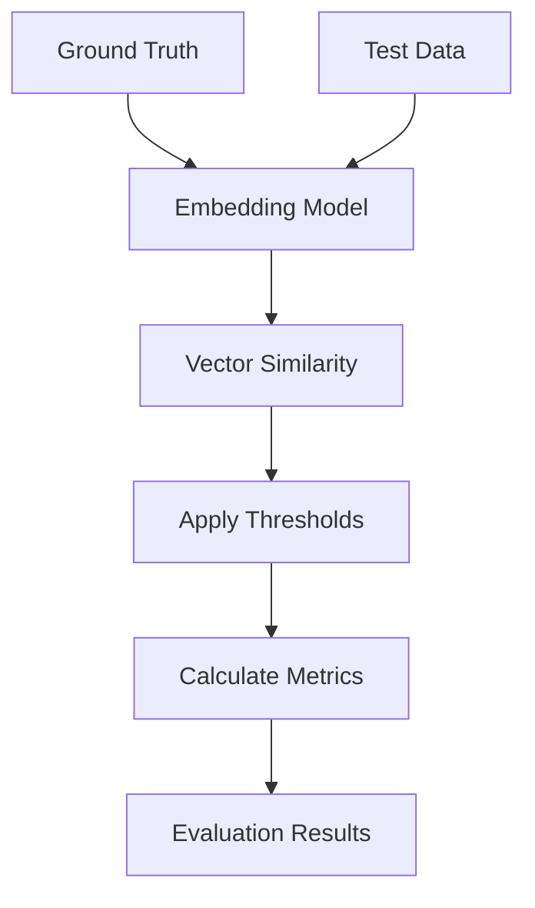

# Semantic Evaluation

This method computes semantic similarity between extracted data and ground truth using specialized embedding models like PhysBERT to assess extraction quality.

## Basic Usage

```python
from comproscanner import evaluate_semantic

results = evaluate_semantic(
    ground_truth_file="ground_truth.json",
    test_data_file="extracted_results.json",
    output_file="evaluation_results.json"
)
```

## Parameters

### Required Parameters

#### :material-square-medium:`ground_truth_file` _(str)_

Path to ground truth data created by human experts.

#### :material-square-medium:`test_data_file` _(str)_

Path to extracted results to be evaluated.

### Optional Parameters

#### :material-square-medium:`weights` _(dict)_

Dictionary specifying weights for each metric during evaluation for ensuring scoring based on importance. The total should sum to 1.0.

#### :material-square-medium:`output_file` _(str)_

Path to save the evaluation results.

#### :material-square-medium:`extraction_agent_model_name` _(str)_

Name of the LLM model used for data extraction (e.g., "gpt-4o-mini").

#### :material-square-medium:`is_synthesis_evaluation` _(bool)_

Whether to evaluate synthesis-related information.

#### :material-square-medium:`use_semantic_model` _(bool)_

Whether to use semantic embedding models for evaluation. If False, will use the fallback SequenceMatcher class from difflib library.

#### :material-square-medium:`primary_model_name` _(str)_

Name of the primary model which will be used for semantic evaluation.

#### :material-square-medium:`fallback_model_name` _(str)_

Name of the fallback model which will be used if the primary model fails for semantic evaluation.

#### :material-square-medium:`similarity_thresholds` _(dict)_

Dictionary specifying similarity thresholds for each metric when using semantic evaluation.

!!! info "Default Values"

    :material-square-small:**`weights`** = {
        "compositions_property_values": 0.3,
        "property_unit": 0.1,
        "family": 0.1,
        "method": 0.1,
        "precursors": 0.15,
        "characterization_techniques": 0.15,
        "steps": 0.1
    }<br>:material-square-small:**`output_file`** = "semantic_evaluation_result.json"<br>:material-square-small:**`extraction_agent_model_name`** = "gpt-4o-mini"<br>:material-square-small:**`is_synthesis_evaluation`** = True<br>:material-square-small:**`use_semantic_model`** = True<br>:material-square-small:**`primary_model_name`** = "huggingface:thellert/physbert_cased"<br>:material-square-small:**`fallback_model_name`** = "all-mpnet-base-v2"<br>
    :material-square-small:**`similarity_thresholds`** = {
        "compositions_property_values": 0.8,
        "property_unit": 0.8,
        "family": 0.8,
        "method": 0.8,
        "precursors": 0.8,
        "characterization_techniques": 0.8,
        "steps": 0.8
    }

## How It Works



## Embedding Models

#### PhysBERT (Recommended)

Physics-aware BERT model trained on scientific literature:

```python
primary_model_name="huggingface:thellert/physbert_cased"
```

**Advantages**:

- Understands materials chemistry
- Better for chemical formulas
- Domain-specific knowledge

#### All-MPNet-Base-V2 (Fallback)

General-purpose sentence transformer:

```python
fallback_model_name="all-mpnet-base-v2"
```

**Advantages**:

- Fast and reliable
- Good general performance
- Wide vocabulary

## Custom Thresholds

Adjust similarity thresholds per metric:

```python
custom_thresholds = {
    "compositions_property_values": 0.85,  # Stricter for compositions
    "property_unit": 0.9,                   # Very strict for units
    "family": 0.7,                          # More lenient for families
    "method": 0.75,
    "precursors": 0.8,
    "characterization_techniques": 0.75,
    "steps": 0.7
}

results = evaluate_semantic(
    ground_truth_file="ground_truth.json",
    test_data_file="test_data.json",
    similarity_thresholds=custom_thresholds
)
```

## Custom Weights

Adjust importance of different metrics:

```python
custom_weights = {
    "compositions_property_values": 0.5,  # Most important
    "property_unit": 0.15,
    "family": 0.05,
    "method": 0.05,
    "precursors": 0.1,
    "characterization_techniques": 0.1,
    "steps": 0.05
}

results = evaluate_semantic(
    ground_truth_file="ground_truth.json",
    test_data_file="test_data.json",
    weights=custom_weights
)
```

## Output Format

```json
{
  "agent_model_name": "DeepSeek-V3-0324",
  "overall_accuracy": 0.8571505434149185,
  "overall_composition_accuracy": 0.812116748251748,
  "overall_synthesis_accuracy": 0.9021843385780889,
  "total_items": 100,
  "absolute_classification_metrics": {
    "true_positives": 2218,
    "false_positives": 1380,
    "false_negatives": 630,
    "precision": 0.6164535853251807,
    "recall": 0.7787921348314607,
    "f1_score": 0.6881787154824698
  },
  "normalized_classification_metrics": {
    "true_positives": 52.921215369679366,
    "false_positives": 32.740265864786316,
    "false_negatives": 14.3385187655343,
    "precision": 0.6177947731819824,
    "recall": 0.7868186820853429,
    "f1_score": 0.6921369967109533
  },
  "item_results": {
    "10.1016/j.jeurceramsoc.2025.117193": {
      "field_scores": {
        "composition_data": 0.9,
        "synthesis_data": 1.0
      },
      "absolute_classification_metrics": {
        "true_positives": 32,
        "false_positives": 3,
        "false_negatives": 3,
        "precision": 0.9142857142857143,
        "recall": 0.9142857142857143,
        "f1_score": 0.9142857142857143
      },
      "normalized_classification_metrics": {
        "true_positives": 0.8421052631578947,
        "false_positives": 0.07894736842105263,
        "false_negatives": 0.07894736842105263,
        "precision": 0.9142857142857143,
        "recall": 0.9142857142857143,
        "f1_score": 0.9142857142857143
      },
      "details": {
        "composition_data": {
          "property_unit": {
            "match": true,
            "reference": "pC/N",
            "test": "pC/N"
          },
          "family": {
            "match": false,
            "reference": "PbNb2O6",
            "test": "PbNb2O6-based"
          },
          "compositions_property_values": {
            "match": true,
            "similarity_score": 1.0,
            "details": {
              "key_matches": {
                "Pb0.85K0.3[Nb0.96Ta0.04]2O6": {
                  "matched_with": "Pb0.85K0.3[Nb0.96Ta0.04]2O6",
                  "similarity": 1.0,
                  "match_type": "exact"
                },
                "Pb0.8K0.4[Nb0.96Ta0.04]2O6": {
                  "matched_with": "Pb0.8K0.4[Nb0.96Ta0.04]2O6",
                  "similarity": 1.0,
                  "match_type": "exact"
                },
                "Pb0.95K0.1[Nb0.96Ta0.04]2O6": {
                  "matched_with": "Pb0.95K0.1[Nb0.96Ta0.04]2O6",
                  "similarity": 1.0,
                  "match_type": "exact"
                },
                "Pb0.9K0.2[Nb0.96Ta0.04]2O6": {
                  "matched_with": "Pb0.9K0.2[Nb0.96Ta0.04]2O6",
                  "similarity": 1.0,
                  "match_type": "exact"
                }
              },
              "value_matches": {
                "Pb0.85K0.3[Nb0.96Ta0.04]2O6": true,
                "Pb0.8K0.4[Nb0.96Ta0.04]2O6": true,
                "Pb0.95K0.1[Nb0.96Ta0.04]2O6": true,
                "Pb0.9K0.2[Nb0.96Ta0.04]2O6": true
              },
              "pair_matches": [
                {
                  "match": true,
                  "reference": {
                    "Pb0.85K0.3[Nb0.96Ta0.04]2O6": 93
                  },
                  "test": {
                    "Pb0.85K0.3[Nb0.96Ta0.04]2O6": 93
                  },
                  "similarity": 1.0,
                  "match_type": "exact"
                },
                {
                  "match": true,
                  "reference": {
                    "Pb0.8K0.4[Nb0.96Ta0.04]2O6": 141
                  },
                  "test": {
                    "Pb0.8K0.4[Nb0.96Ta0.04]2O6": 141
                  },
                  "similarity": 1.0,
                  "match_type": "exact"
                },
                {
                  "match": true,
                  "reference": {
                    "Pb0.95K0.1[Nb0.96Ta0.04]2O6": 44
                  },
                  "test": {
                    "Pb0.95K0.1[Nb0.96Ta0.04]2O6": 44
                  },
                  "similarity": 1.0,
                  "match_type": "exact"
                },
                {
                  "match": true,
                  "reference": {
                    "Pb0.9K0.2[Nb0.96Ta0.04]2O6": 54
                  },
                  "test": {
                    "Pb0.9K0.2[Nb0.96Ta0.04]2O6": 54
                  },
                  "similarity": 1.0,
                  "match_type": "exact"
                }
              ],
              "key_match_ratio": 1.0,
              "value_match_ratio": 1.0,
              "pair_match_ratio": 1.0,
              "overall_match_ratio": 1.0,
              "exact_matches": 4,
              "high_similarity_matches": 0,
              "missing_keys": [],
              "extra_keys": [],
              "similarity_threshold_used": 0.9,
              "fractional_value": 0.25,
              "total_reference_items": 4
            }
          }
        },
        "synthesis_data": {
          "method": {
            "match": true,
            "reference": "solid-state reaction",
            "test": "solid-state reaction",
            "similarity": 1.0000001192092896
          },
          "precursors": {
            "match": true,
            "similarity": 1.0,
            "reference": ["PbO", "K2CO3", "Nb2O5", "Ta2O5"],
            "test": ["PbO", "K2CO3", "Nb2O5", "Ta2O5"],
            "very_high_similarity_matches": [
              {
                "reference": "PbO",
                "test": "PbO",
                "similarity": 1.0
              },
              {
                "reference": "K2CO3",
                "test": "K2CO3",
                "similarity": 1.0
              },
              {
                "reference": "Nb2O5",
                "test": "Nb2O5",
                "similarity": 1.0000001192092896
              },
              {
                "reference": "Ta2O5",
                "test": "Ta2O5",
                "similarity": 1.0
              }
            ],
            "high_similarity_matches": [],
            "missing_items": [],
            "extra_items": [],
            "fractional_value": 0.25
          },
          "characterization_techniques": {
            "match": true,
            "similarity": 0.8571428571428571,
            "reference": [
              "XRD",
              "SEM",
              "EDS",
              "XPS",
              "Raman spectroscopy",
              "d33 tester",
              "LCR meter"
            ],
            "test": [
              "XRD",
              "SEM",
              "EDS",
              "XPS",
              "Raman spectroscopy",
              "Quasi-static d33 tester",
              "LCR meter"
            ],
            "very_high_similarity_matches": [
              {
                "reference": "XRD",
                "test": "XRD",
                "similarity": 1.0000001192092896
              },
              {
                "reference": "SEM",
                "test": "SEM",
                "similarity": 0.9999998807907104
              },
              {
                "reference": "EDS",
                "test": "EDS",
                "similarity": 1.0
              },
              {
                "reference": "XPS",
                "test": "XPS",
                "similarity": 1.0
              },
              {
                "reference": "Raman spectroscopy",
                "test": "Raman spectroscopy",
                "similarity": 0.9999998807907104
              },
              {
                "reference": "LCR meter",
                "test": "LCR meter",
                "similarity": 1.0000001192092896
              }
            ],
            "high_similarity_matches": [],
            "missing_items": ["d33 tester"],
            "extra_items": ["Quasi-static d33 tester"],
            "fractional_value": 0.14285714285714285
          },
          "steps": {
            "reference_steps": [
              "Raw materials were weighed according to stoichiometric ratio and ball-milled with zirconia balls in nylon jars for 12 hours.",
              "Additional 2 wt% PbO was introduced for compensating volatilization during sintering process.",
              "After drying at 120\u00b0C, powders were calcined at 900\u00b0C for 4 hours and re-milled for another 6 hours.",
              "Dried powders were mixed with polyvinyl alcohol binder and sieved through screen mesh.",
              "Particles were pressed into pellets with diameter of 12 mm and thickness around 1.2 mm under uniaxial pressure of 15 MPa.",
              "Green pellets were fired at 500\u00b0C for 2 hours for binder burn-out.",
              "Specimens were sintered at 1190-1250\u00b0C for 1 hour.",
              "Cooling process was controlled at 3\u00b0C/min till 600\u00b0C to prevent ceramics from cracking.",
              "Natural cooling without quenching was performed below 600\u00b0C.",
              "Sintered pellets were coated with silver paste on both surfaces and dried at 120\u00b0C for 30 minutes.",
              "Samples were polarized in silicon oil at 150\u00b0C with DC electric field up to 4 kV/mm for 30 minutes."
            ],
            "test_steps": [
              "Weigh raw materials according to stoichiometric ratio",
              "Ball-mill with zirconia balls in nylon jars for 12 h",
              "Add 2 wt% PbO to compensate volatilization",
              "Dry at 120 \u00b0C",
              "Calcinate at 900 \u00b0C for 4 h",
              "Re-mill for 6 h",
              "Mix with PVA binder and sieve",
              "Press into pellets (12 mm diameter, 1.2 mm thickness) under 15 MPa",
              "Fire at 500 \u00b0C for 2 h for binder burn-out",
              "Sinter at 1190-1250 \u00b0C for 1 h",
              "Control cooling at 3 \u00b0C/min till 600 \u00b0C",
              "Natural cooling below 600 \u00b0C"
            ],
            "paragraph_similarity": 0.8826380372047424,
            "steps_match": true,
            "paragraph_comparison": {
              "similarity_score": 0.8826380372047424,
              "high_similarity": true,
              "method": "sequence_matcher"
            }
          }
        }
      },
      "overall_score": 0.95,
      "overall_match": true
    }
    // More items...
  }
}
```

## Next Steps

- Try [Agentic Evaluation](agentic.md) for comparison
- Visualize results with [Evaluation Visualizer](../visualization/eval-viz.md)
- Learn about [RAG Configuration](../../rag-config.md)
